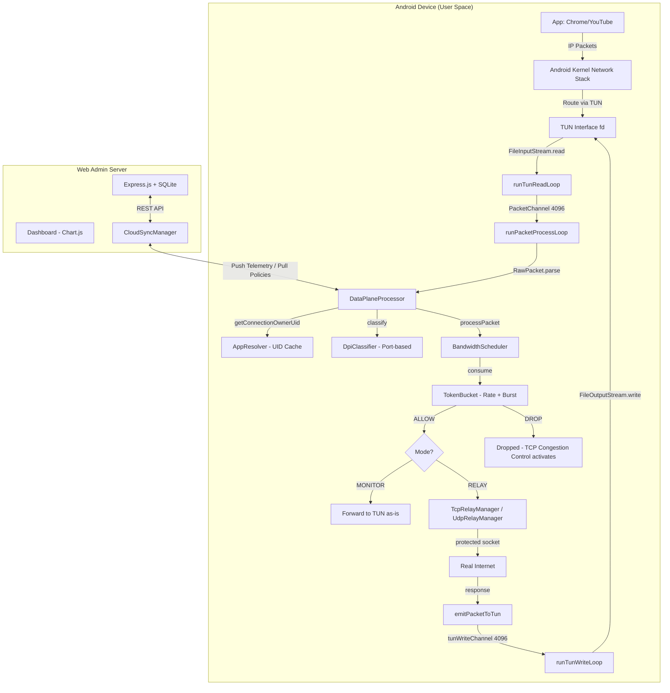

# Theoretical Foundations of the QoS Scheduler Project

> **Purpose:** This document presents the theoretical foundations from three academic disciplines — **Computer Networking**, **Operating Systems**, and **Android Programming** — and maps each concept directly to its implementation in the QoSScheduler project. It is designed as a comprehensive reference for thesis defense (vấn đáp đồ án).

---

## Table of Contents

1. [Part I — Computer Networking](#part-i--computer-networking)
   - [1.1 The OSI Model and TCP/IP Model](#11-the-osi-model-and-tcpip-model)
   - [1.2 IP Packet Structure (IPv4 & IPv6)](#12-ip-packet-structure-ipv4--ipv6)
   - [1.3 Transmission Control Protocol (TCP)](#13-transmission-control-protocol-tcp)
   - [1.4 User Datagram Protocol (UDP)](#14-user-datagram-protocol-udp)
   - [1.5 TCP Congestion Control](#15-tcp-congestion-control)
   - [1.6 Token Bucket Algorithm](#16-token-bucket-algorithm)
   - [1.7 Weighted Fair Queuing (WFQ)](#17-weighted-fair-queuing-wfq)
   - [1.8 Deep Packet Inspection (DPI)](#18-deep-packet-inspection-dpi)
   - [1.9 TUN/TAP Virtual Network Interfaces](#19-tuntap-virtual-network-interfaces)
   - [1.10 DNS Resolution](#110-dns-resolution)
   - [1.11 Network Address Translation & Flow Identification](#111-network-address-translation--flow-identification)
2. [Part II — Operating Systems](#part-ii--operating-systems)
   - [2.1 Kernel Space vs User Space](#21-kernel-space-vs-user-space)
   - [2.2 Process Isolation and UID Model](#22-process-isolation-and-uid-model)
   - [2.3 File Descriptors](#23-file-descriptors)
   - [2.4 Concurrency and Thread Safety](#24-concurrency-and-thread-safety)
   - [2.5 Producer-Consumer Pattern](#25-producer-consumer-pattern)
   - [2.6 Object Pooling](#26-object-pooling)
   - [2.7 Memory Management and Caching Strategies](#27-memory-management-and-caching-strategies)
3. [Part III — Android Programming](#part-iii--android-programming)
   - [3.1 Android VpnService API](#31-android-vpnservice-api)
   - [3.2 ConnectivityManager and Network APIs](#32-connectivitymanager-and-network-apis)
   - [3.3 Foreground Services and Lifecycle](#33-foreground-services-and-lifecycle)
   - [3.4 Kotlin Coroutines and Structured Concurrency](#34-kotlin-coroutines-and-structured-concurrency)
   - [3.5 Jetpack Compose and Reactive UI](#35-jetpack-compose-and-reactive-ui)
   - [3.6 MVVM Architecture Pattern](#36-mvvm-architecture-pattern)
   - [3.7 Client-Server Synchronization](#37-client-server-synchronization)

---

# Part I — Computer Networking

## 1.1 The OSI Model and TCP/IP Model

### Theory

The **Open Systems Interconnection (OSI)** model defines 7 abstraction layers for network communication. In practice, the Internet uses the simplified **TCP/IP model** with 4 layers:

| TCP/IP Layer       | OSI Equivalent      | Function                          | Key Protocols          |
|--------------------|----------------------|-----------------------------------|------------------------|
| **Application**    | Layers 5–7           | End-user data formatting          | HTTP, DNS, QUIC        |
| **Transport**      | Layer 4               | End-to-end delivery & reliability | TCP (6), UDP (17)      |
| **Internet**       | Layer 3               | Logical addressing & routing      | IPv4, IPv6, ICMP       |
| **Network Access** | Layers 1–2            | Physical transmission             | Ethernet, Wi-Fi        |

Data flows **downward** through encapsulation: an HTTP request becomes a TCP segment, wrapped in an IP packet, wrapped in an Ethernet frame. The receiving host reverses this process (**decapsulation**).

### Application in the Project

The QoS Scheduler operates primarily at **Layer 3 (Internet) and Layer 4 (Transport)** of the TCP/IP model. The system intercepts IP packets after they leave the Application layer but before they reach the physical Network Access layer.

The entire packet processing pipeline in [QosVpnService.kt](file:///c:/Users/hieum/AndroidStudioProjects/QoSScheduler/app/src/main/java/com/qos/scheduler/service/QosVpnService.kt) works at the IP packet level:

```
App (Layer 7) → OS Network Stack (Layer 4/3) → TUN Interface → QoS Scheduler → Internet
```

The parsing logic in [RawPacket.kt](file:///c:/Users/hieum/AndroidStudioProjects/QoSScheduler/app/src/main/java/com/qos/scheduler/model/RawPacket.kt) physically decodes Layer 3 headers (IP version, source/destination addresses) and Layer 4 headers (TCP/UDP ports, sequence numbers, flags), effectively performing manual decapsulation in user space.

---

## 1.2 IP Packet Structure (IPv4 & IPv6)

### Theory

#### IPv4 Header (RFC 791)

An IPv4 packet header is **variable-length** (20–60 bytes). The critical fields are:

| Offset (bytes) | Field              | Size    | Description                           |
|----------------|--------------------|---------|---------------------------------------|
| 0              | Version + IHL      | 1 byte  | Version (4 bits) + Header Length (4 bits, in 32-bit words) |
| 9              | Protocol           | 1 byte  | 6 = TCP, 17 = UDP                    |
| 12–15          | Source IP           | 4 bytes | Sender's address                      |
| 16–19          | Destination IP      | 4 bytes | Receiver's address                    |

The **IHL (Internet Header Length)** field is crucial: it tells the parser where the transport header begins. `IHL * 4` gives the header size in bytes.

#### IPv6 Header (RFC 8200)

IPv6 uses a **fixed 40-byte** base header, but may have **Extension Headers** chained via the `Next Header` field:

| Extension Header Type | Value | Header Size |
|----------------------|-------|-------------|
| Hop-by-Hop Options   | 0     | Variable (8 + length field) |
| Routing              | 43    | Variable    |
| Fragment             | 44    | Fixed 8 bytes |
| Destination Options  | 60    | Variable    |

The parser must traverse the extension header chain to find the actual transport protocol (TCP = 6, UDP = 17).

### Application in the Project

The class [RawPacket](file:///c:/Users/hieum/AndroidStudioProjects/QoSScheduler/app/src/main/java/com/qos/scheduler/model/RawPacket.kt) implements full binary parsing for both IPv4 and IPv6:

**IPv4 parsing** (`parseIpv4()`, lines 51–101):
```kotlin
// Extract IHL from first byte's lower nibble
val ihl = (buffer.get(0).toInt() and 0x0F) * 4  // Variable header length

// Protocol at byte offset 9
val protocol = Protocol.fromNumber(buffer.get(9).toInt() and 0xFF)

// Source IP: bytes 12-15, formatted as dotted decimal
val srcIp = "${buffer.get(12)}.${buffer.get(13)}.${buffer.get(14)}.${buffer.get(15)}"
```

**IPv6 extension header traversal** (`parseIpv6()`, lines 110–124):
```kotlin
// Follow the extension header chain until reaching TCP or UDP
while (nextHeader in listOf(0, 43, 44, 60)) {
    val extLen = if (nextHeader == 44) 8  // Fragment header is fixed 8 bytes
                 else (buffer.get(offset + 1).toInt() and 0xFF + 1) * 8
    nextHeader = buffer.get(offset).toInt() and 0xFF
    offset += extLen
}
```

This is a textbook implementation of RFC 8200 Section 4's "Extension Header Processing" algorithm: follow the `Next Header` chain until reaching an upper-layer protocol.

---

## 1.3 Transmission Control Protocol (TCP)

### Theory

TCP (RFC 793) provides **reliable, ordered, connection-oriented** byte-stream delivery. Key mechanisms:

1. **Three-Way Handshake:** SYN → SYN+ACK → ACK (establishes connection)
2. **Sequence Numbers:** Each byte of data is numbered; the receiver uses ACK numbers to confirm receipt
3. **Flow Control (Window):** The receiver advertises a window size indicating how much data it can buffer
4. **Retransmission:** Lost packets (no ACK received within timeout) are automatically resent
5. **Connection Termination:** FIN → ACK (graceful close) or RST (abrupt reset)

#### TCP Flags (byte offset 13 of TCP header):

| Bit | Flag | Meaning |
|-----|------|---------|
| 0   | FIN  | Sender finished sending data |
| 1   | SYN  | Synchronize sequence numbers (initiate connection) |
| 2   | RST  | Reset the connection (abort) |
| 3   | PSH  | Push data to application immediately |
| 4   | ACK  | Acknowledgment number field is valid |

### Application in the Project

[TcpRelayManager.kt](file:///c:/Users/hieum/AndroidStudioProjects/QoSScheduler/app/src/main/java/com/qos/scheduler/service/relay/TcpRelayManager.kt) implements a **full user-space TCP state machine** that simulates the three-way handshake and data transfer:

**Handshake simulation** (inner class `TcpFlow`, lines 183–225):
```
1. App sends SYN → TcpFlow receives it, responds with SYN+ACK via TUN
   (serverSeq initialized with random value, mimicking real TCP)
2. App sends ACK → State transitions to ESTABLISHED
3. App sends DATA → TcpFlow forwards to real server socket,
   sends ACK back to app with correct sequence numbers
```

**TCP flag parsing** in [RawPacket.kt](file:///c:/Users/hieum/AndroidStudioProjects/QoSScheduler/app/src/main/java/com/qos/scheduler/model/RawPacket.kt#L173-L196):
```kotlin
val flagsByte = buffer.get(offset + 13).toInt() and 0xFF
val isFIN = (flagsByte and 0x01) != 0  // bit 0
val isSYN = (flagsByte and 0x02) != 0  // bit 1
val isRST = (flagsByte and 0x04) != 0  // bit 2
val isPSH = (flagsByte and 0x08) != 0  // bit 3
val isACK = (flagsByte and 0x10) != 0  // bit 4
```

**Flow Control implementation** (`startReadLoop()`, lines 252–289):
```kotlin
// If unacknowledged bytes exceed client's advertised window, pause sending
if (unackedBytes >= clientWindow) {
    delay(50)  // Backpressure — wait for ACK to free up window space
}
```

This precisely implements TCP's sliding window flow control: the relay respects the client's window size advertisement to avoid overwhelming the app's receive buffer.

**MSS (Maximum Segment Size)** — Data is segmented into 1340-byte chunks (lines 270–275), which is below the 1400-byte MTU configured on the TUN interface, leaving room for IP + TCP headers (40–60 bytes).

---

## 1.4 User Datagram Protocol (UDP)

### Theory

UDP (RFC 768) is a **connectionless, unreliable** transport protocol. Properties:
- **No handshake** — data is sent immediately
- **No retransmission** — lost packets are permanently lost
- **No flow control** — sender can transmit at any rate
- **No congestion control** — does not respond to network congestion
- **Fixed 8-byte header:** Source Port (2) + Dest Port (2) + Length (2) + Checksum (2)

UDP is used when **low latency** is more important than reliability: VoIP, online gaming, DNS queries, live streaming.

### Application in the Project

[UdpRelayManager.kt](file:///c:/Users/hieum/AndroidStudioProjects/QoSScheduler/app/src/main/java/com/qos/scheduler/service/relay/UdpRelayManager.kt) handles UDP differently from TCP because there is no connection state to track:

**Stateless relay** (lines 51–72):
```kotlin
// No handshake needed — create flow on first packet, forward immediately
val flow = flows.getOrPut(flowId) { UdpFlow(...).also { it.start() } }
flow.send(payload)
```

**Practical limitation — UDP and QoS throttling:**

When the Token Bucket drops UDP packets, there is **no automatic slowdown**. Unlike TCP (which reduces sending rate when packets are lost), a UDP sender has no built-in congestion response. This means:
- Dropping UDP packets causes **quality degradation** (stuttering audio, frozen video, game lag)
- But does NOT cause **bandwidth reduction** from the server's perspective
- This is a fundamental protocol-level limitation, not a bug in the implementation

> [!IMPORTANT]
> Modern protocols like **QUIC** (used by YouTube, Google services) run over UDP but implement their own congestion control. The QoS Scheduler's packet dropping **does** effectively throttle QUIC traffic, making it work similarly to TCP for the majority of streaming use cases.

---

## 1.5 TCP Congestion Control

### Theory

TCP Congestion Control (RFC 5681) is the mechanism that makes QoS packet dropping effective. The key algorithms:

1. **Slow Start:** After connection establishment, TCP doubles its sending rate every RTT (Round-Trip Time) until it detects loss
2. **Congestion Avoidance:** After detecting loss, TCP reduces its congestion window (cwnd) and grows linearly
3. **Fast Retransmit:** When 3 duplicate ACKs are received, TCP retransmits the missing segment immediately
4. **Fast Recovery:** After fast retransmit, TCP halves cwnd instead of resetting to 1

The critical insight: **When packets are dropped, the sender does not receive ACKs, causing it to reduce its sending rate.** This is the fundamental principle behind traffic shaping.

```
Server sends packets → QoS drops some → Server gets no ACK
→ Server's TCP stack detects "congestion" → cwnd shrinks → Sending rate decreases
```

### Application in the Project

This is the **core mechanism** that enables QoS bandwidth control. In [QosVpnService.kt](file:///c:/Users/hieum/AndroidStudioProjects/QoSScheduler/app/src/main/java/com/qos/scheduler/service/QosVpnService.kt), the `emitPacketToTun()` method (lines 790–808) applies Token Bucket scheduling to **inbound** traffic:

```kotlin
// CRITICAL: Apply Token Bucket decision to inbound traffic
// If we drop inbound packets, TCP Congestion Control will naturally
// slow down the sender, effectively throttling download speed.
if (decision.droppedByScheduler) {
    droppedPacketsCount.incrementAndGet()
    return // DROP PACKET — sender's TCP will reduce cwnd
}
```

**Why this works for downloads (inbound):**
The server sends data → the QoS Scheduler intercepts and drops excess packets → the server's TCP stack doesn't receive ACKs → triggers congestion avoidance → the server voluntarily reduces its sending rate. The file download will be slower but complete without corruption because TCP retransmits all dropped segments.

**Why this works for uploads (outbound):**
The app sends data → the QoS Scheduler drops excess outbound packets before they reach the network → the remote server doesn't receive the data → doesn't send ACK → the app's TCP stack triggers retransmission and reduces sending rate.

---

## 1.6 Token Bucket Algorithm

### Theory

The **Token Bucket** (RFC 2697, RFC 2698) is a traffic shaping algorithm used in network devices (routers, firewalls) to control bandwidth. The model:

1. A "bucket" holds **tokens** (measured in bits)
2. Tokens are continuously added at a fixed **rate** (bits per second)
3. The bucket has a maximum capacity called **burst size** (maximum tokens it can hold)
4. Each packet arriving must **consume tokens** equal to its size (in bits)
5. If enough tokens are available → packet is **allowed** (conforming)
6. If not enough tokens → packet is **dropped** or **delayed** (non-conforming)

**Mathematical model:**
```
tokens(t) = min(burst, tokens(t-1) + rate × Δt)
allow(packet) = tokens ≥ packet_size × 8
```

**Key properties:**
- **Rate** controls the average bandwidth (long-term throughput)
- **Burst** controls the maximum instantaneous throughput (short-term spikes)
- A larger burst allows temporary speed bursts above the rate limit (useful for web page loading)

### Application in the Project

[TokenBucket.kt](file:///c:/Users/hieum/AndroidStudioProjects/QoSScheduler/app/src/main/java/com/qos/scheduler/scheduler/TokenBucket.kt) implements the algorithm with **continuous refill** (on-demand calculation rather than periodic timer):

```kotlin
// Token refill — called before every consume()
private fun refill() {
    val now = System.nanoTime()
    val elapsed = (now - lastRefillTime) / 1_000_000_000.0  // seconds
    tokens = min(burstBits.toDouble(), tokens + rateBps * elapsed)
    lastRefillTime = now
}

// Consume — the core admission control decision
@Synchronized
fun consume(bytes: Int): Boolean {
    refill()
    val bitsNeeded = bytes * 8.0
    return if (tokens >= bitsNeeded) {
        tokens -= bitsNeeded
        true   // ALLOW packet
    } else {
        false  // DROP packet
    }
}
```

**Why continuous refill is superior to periodic refill:**

A periodic timer (e.g., refill every 100ms) would cause **bursty behavior**: all tokens arrive at once every interval, creating micro-bursts. The continuous model calculates tokens proportional to the exact elapsed time since the last packet, producing **smooth, uniform** traffic shaping.

**Burst differentiation by priority** (in [BandwidthScheduler.kt](file:///c:/Users/hieum/AndroidStudioProjects/QoSScheduler/app/src/main/java/com/qos/scheduler/scheduler/BandwidthScheduler.kt), lines 133–167):

| Priority | Rate Multiplier | Burst Multiplier | Effect |
|----------|----------------|-------------------|--------|
| HIGH     | weight 4       | `rate × 5`        | Can spike to 5× its average rate briefly |
| MEDIUM   | weight 2       | `rate × 2`        | Moderate burst tolerance |
| LOW      | weight 1       | `rate / 2` (min 1)| Very small burst, nearly constant rate |

The `coerceAtLeast(1L)` on LOW burst prevents **starvation** — a burst of 0 would mean the bucket can never hold any tokens, permanently blocking all traffic.

---

## 1.7 Weighted Fair Queuing (WFQ)

### Theory

**Weighted Fair Queuing** (proposed by Demers, Keshav, Shenker, 1989) is a scheduling algorithm that divides shared bandwidth among competing flows proportionally to assigned **weights**.

**Mathematical model:**
Given total bandwidth `B`, and flows with weights `w₁, w₂, ..., wₙ`:

```
Bandwidth for flow i = B × (wᵢ / Σwⱼ)
```

Example: With B = 100 Mbps and 3 flows with weights 4, 2, 1:
- Flow 1: `100 × 4/7 ≈ 57.1 Mbps`
- Flow 2: `100 × 2/7 ≈ 28.6 Mbps`
- Flow 3: `100 × 1/7 ≈ 14.3 Mbps`

WFQ guarantees that **no flow starves** (every flow gets at least `B × wᵢ/Σwⱼ`) while ensuring **proportional fairness** (higher-weight flows get proportionally more).

### Application in the Project

[BandwidthScheduler.kt](file:///c:/Users/hieum/AndroidStudioProjects/QoSScheduler/app/src/main/java/com/qos/scheduler/scheduler/BandwidthScheduler.kt) implements WFQ through its `rebalanceWithApps()` method (lines 133–167):

```kotlin
fun rebalanceWithApps(apps: Collection<AppTraffic>) {
    val highCount = apps.count { it.priorityClass == TrafficClass.HIGH }
    val medCount  = apps.count { it.priorityClass == TrafficClass.MEDIUM }
    val lowCount  = apps.count { it.priorityClass == TrafficClass.LOW }

    // Total weight = Σ(count × weight) + host_weight
    val totalWeight = (highCount * 4) + (medCount * 2) + (lowCount * 1) + 2

    apps.forEach { app ->
        val weight = when (app.priorityClass) {
            TrafficClass.HIGH   -> 4
            TrafficClass.MEDIUM -> 2
            TrafficClass.LOW    -> 1
        }
        val rate = (uplinkBps * weight) / totalWeight
        val burst = when (app.priorityClass) {
            TrafficClass.HIGH   -> rate * 5
            TrafficClass.MEDIUM -> rate * 2
            TrafficClass.LOW    -> (rate / 2).coerceAtLeast(1L)
        }
        bucket.setRateAndBurst(rate, burst)
    }
}
```

**Concrete example in QoSScheduler:**

Assume `uplinkBps = 100 Mbps`, with Chrome (LOW), YouTube (HIGH), Messenger (MEDIUM):
- `totalWeight = (1×4) + (1×2) + (1×1) + 2 = 9`
- YouTube (HIGH, w=4): `rate = 100 × 4/9 ≈ 44.4 Mbps`, burst = `222 Mbps`
- Messenger (MEDIUM, w=2): `rate = 100 × 2/9 ≈ 22.2 Mbps`, burst = `44.4 Mbps`
- Chrome (LOW, w=1): `rate = 100 × 1/9 ≈ 11.1 Mbps`, burst = `5.6 Mbps`
- Host bucket (w=2): `rate = 100 × 2/9 ≈ 22.2 Mbps`

This ensures YouTube gets **4× the bandwidth** of Chrome while Messenger gets **2× Chrome's share**, exactly matching the WFQ theoretical model.

---

## 1.8 Deep Packet Inspection (DPI)

### Theory

**Deep Packet Inspection** is a network analysis technique that examines packet payloads (beyond headers) to classify traffic by application or protocol. DPI ranges from simple to complex:

1. **Port-based classification** — Uses well-known port numbers (e.g., 80 = HTTP, 443 = HTTPS)
2. **Pattern matching** — Looks for protocol signatures in payload (e.g., HTTP "GET" request)
3. **Statistical/ML-based** — Analyzes packet timing, sizes, flow patterns
4. **TLS fingerprinting** — Uses Client Hello extensions to identify applications

### Application in the Project

[DpiClassifier.kt](file:///c:/Users/hieum/AndroidStudioProjects/QoSScheduler/app/src/main/java/com/qos/scheduler/classifier/DpiClassifier.kt) implements **Level 1: Port-based classification**:

```kotlin
fun classify(packet: RawPacket): TrafficCategory {
    val dstPort = packet.dstPort
    return when {
        // VoIP (HIGH priority)
        packet.protocol == Protocol.UDP && dstPort in 5060..5061 -> VOIP        // SIP
        packet.protocol == Protocol.UDP && dstPort in 10000..20000 -> VOIP      // RTP range

        // Gaming (HIGH priority)
        dstPort in 27015..27016 -> ONLINE_GAMING  // Steam/Valve
        dstPort in listOf(5000, 5500) -> ONLINE_GAMING  // Mobile Legends

        // DNS (Infrastructure)
        dstPort == 53 -> WEB_BROWSING

        // Web/Social (MEDIUM priority)
        dstPort == 80 || dstPort == 443 -> WEB_BROWSING

        // Downloads (LOW priority)
        dstPort in listOf(21, 22, 143, 993, 110, 995) -> FILE_TRANSFER

        else -> UNKNOWN
    }
}
```

**Limitation and design rationale:**

Since the majority of modern traffic is encrypted (HTTPS on port 443, QUIC on UDP 443), payload-level DPI is ineffective without TLS interception (which would require installing a root CA — a privacy concern). The project compensates by using **UID-based identification** via `AppResolver` instead: rather than asking "*what protocol is this?*", it asks "*which app sent this?*" — a far more useful classification for per-app QoS.

---

## 1.9 TUN/TAP Virtual Network Interfaces

### Theory

**TUN** (network TUNnel) and **TAP** (network TAP) are virtual network kernel interfaces:

| Interface | Operates at | Delivers          | Use Case |
|-----------|------------|---------------------|----------|
| **TUN**   | Layer 3    | Raw IP packets      | VPN, traffic shaping |
| **TAP**   | Layer 2    | Ethernet frames     | Virtual switches, bridging |

A **TUN device** creates a point-to-point tunnel: the kernel routes packets destined for the TUN's IP range into a special file descriptor. A user-space program reads raw IP packets from this fd, processes them, and writes responses back.

```
Application → Kernel Network Stack → TUN fd → User-Space Program → Real Network
                                           ← (response) ←
```

### Application in the Project

Android's `VpnService` internally creates a TUN device. In [QosVpnService.kt](file:///c:/Users/hieum/AndroidStudioProjects/QoSScheduler/app/src/main/java/com/qos/scheduler/service/QosVpnService.kt), the TUN interface is configured and accessed:

**Creation** (lines 528–601):
```kotlin
val builder = Builder()
    .setSession("QoS Scheduler")
    .addAddress("10.0.0.1", 32)          // TUN interface IP
    .addAddress("fd00:716f:733a:7363::1", 64)  // IPv6
    .setMtu(1400)                         // Maximum Transmission Unit
    .addRoute("0.0.0.0", 0)              // Capture ALL IPv4 traffic
    .addRoute("::", 0)                    // Capture ALL IPv6 traffic

tunInterface = builder.establish()  // Returns ParcelFileDescriptor
```

**Reading raw IP packets** (`runTunReadLoop`, lines 663–695):
```kotlin
val inputStream = FileInputStream(tun.fileDescriptor)
val buffer = packetPool.acquire()          // Get a 32KB buffer from pool
val length = inputStream.read(buffer)      // Blocking read — returns raw IP packet
```

**Writing packets back** (`runTunWriteLoop`, lines 697–710):
```kotlin
val outputStream = FileOutputStream(tun.fileDescriptor)
outputStream.write(packet)  // Write raw IP packet back to TUN
```

The route `0.0.0.0/0` tells the kernel: "send ALL traffic through this TUN interface." This is how the QoS Scheduler captures every app's network traffic without root access.

---

## 1.10 DNS Resolution

### Theory

The **Domain Name System** (RFC 1035) translates human-readable domain names (e.g., `youtube.com`) into IP addresses. DNS queries typically use **UDP port 53** (or TCP for large responses/zone transfers, and UDP port 853 for DNS-over-TLS).

A DNS resolution failure means applications cannot connect to any domain — effectively killing all internet access.

### Application in the Project

The VPN builder auto-detects system DNS servers (lines 538–549):

```kotlin
val linkProperties = activeNetwork?.let { cm.getLinkProperties(it) }
val dnsServers = linkProperties?.dnsServers?.take(2)
if (dnsServers != null && dnsServers.isNotEmpty()) {
    dnsServers.forEach { dns -> builder.addDnsServer(dns.hostAddress) }
} else {
    builder.addDnsServer("8.8.8.8")    // Google Public DNS fallback
    builder.addDnsServer("8.8.4.4")
}
```

The health monitor specifically tracks DNS error rates (in `incrementDnsError()`, lines 237–254). If DNS errors exceed 70%, the system falls back to MONITOR mode to prevent total connectivity loss:

```kotlin
if (dnsErrorRate > 0.7) -> RelayFallbackReason.DNS_ERROR_RATE
```

The DPI classifier also tags DNS traffic (port 53) as `WEB_BROWSING` priority to ensure DNS resolution is never starved by QoS policies.

---

## 1.11 Network Address Translation & Flow Identification

### Theory

A **network flow** is uniquely identified by a **5-tuple**:
```
(Source IP, Destination IP, Source Port, Destination Port, Protocol)
```

This 5-tuple is the fundamental unit of traffic classification in firewalls, NATs, and QoS systems. All packets belonging to the same TCP connection or UDP session share the same 5-tuple.

### Application in the Project

[FlowKey](file:///c:/Users/hieum/AndroidStudioProjects/QoSScheduler/app/src/main/java/com/qos/scheduler/model/FlowKey.kt) is the data class representing this 5-tuple:
```kotlin
data class FlowKey(
    val srcIp: String,
    val dstIp: String,
    val srcPort: Int,
    val dstPort: Int,
    val protocol: Protocol
)
```

In [DataPlaneProcessor.kt](file:///c:/Users/hieum/AndroidStudioProjects/QoSScheduler/app/src/main/java/com/qos/scheduler/service/dataplane/DataPlaneProcessor.kt), flow keys are **direction-normalized** (lines 60–68):
```kotlin
// Outbound: src=app, dst=server  →  FlowKey(appIP, serverIP, appPort, serverPort)
// Inbound:  src=server, dst=app  →  FlowKey(appIP, serverIP, appPort, serverPort)
// Both directions map to the SAME FlowKey — crucial for bidirectional tracking
```

This normalization ensures that a YouTube video download (server → app) and the corresponding ACK packets (app → server) are tracked under the same flow, which is essential for accurate per-app byte counting.

---

# Part II — Operating Systems

## 2.1 Kernel Space vs User Space

### Theory

Modern operating systems divide memory into two regions:

- **Kernel Space:** Privileged code (device drivers, network stack, file systems). Has direct hardware access. Runs at CPU Ring 0.
- **User Space:** Application code. Restricted access. Must use **system calls (syscalls)** to request kernel services. Runs at CPU Ring 3.

The network stack (TCP/IP processing, routing, packet forwarding) normally runs entirely in kernel space for maximum performance. Moving packet processing to user space incurs a **context switch overhead** for every packet.

### Application in the Project

The QoS Scheduler deliberately moves packet processing from kernel space to user space via the TUN interface:

```
Normal path:   App → syscall → Kernel TCP/IP → NIC → Internet    (fast, no QoS)
QoS path:      App → syscall → Kernel → TUN → User Space → Kernel → NIC → Internet
                                              ↑
                                        QoS processing here
```

**Performance implication** (in `runTunReadLoop`, line 665):
```kotlin
val length = inputStream.read(buffer)  // Blocking syscall: read() from TUN fd
```

Each `read()` call crosses the kernel/user space boundary. For high-throughput scenarios (>500 Mbps), this becomes the bottleneck. The project mitigates this by:
1. Using a **PacketPool** to avoid memory allocation per packet
2. Using **Channel-based pipeline** to separate I/O from processing
3. Limiting parallelism to `Dispatchers.IO.limitedParallelism(8)` to prevent thread exhaustion

**Critical I/O behavior** — Blocking I/O in kernel space does NOT respond to Kotlin coroutine cancellation. The project handles this explicitly (lines 637–644):
```kotlin
// CRITICAL: Close streams FIRST to unblock I/O operations
// FileInputStream.read() blocks at kernel level — coroutine cancellation has no effect
runCatching { tunInputStream?.close() }   // Forces read() to throw IOException
tunInputStream = null
```

---

## 2.2 Process Isolation and UID Model

### Theory

Unix/Linux (and Android) assigns each user/process a **UID (User Identifier)**. Android extends this: each app gets a unique UID at install time. The kernel tracks which UID owns each network socket, enabling per-app traffic identification without root access.

The `/proc/net/tcp` and `/proc/net/udp` files in Linux expose socket-to-UID mappings. Android provides a higher-level API: `ConnectivityManager.getConnectionOwnerUid()`.

### Application in the Project

[AppResolver.kt](file:///c:/Users/hieum/AndroidStudioProjects/QoSScheduler/app/src/main/java/com/qos/scheduler/util/AppResolver.kt) uses this UID model to identify which app owns each packet:

```kotlin
// API call: given a 5-tuple, find the owning UID
val uid = cm.getConnectionOwnerUid(protocol, localAddr, remoteAddr)
```

**Special UID values:**
```kotlin
companion object {
    private val SYSTEM_UIDS = mapOf(
        0    to "Root",
        1000 to "Android System",
        1001 to "Phone Service",
        2000 to "Shell / ADB",
    )
}
```

UID `-1` means the kernel itself owns the socket (e.g., during initial TCP handshake). The project handles this edge case by NOT caching -1 and retrying on subsequent packets (3-retry strategy with negative cache).

---

## 2.3 File Descriptors

### Theory

A **file descriptor (fd)** is an integer handle that the kernel assigns to open files, sockets, pipes, and devices. In Unix, "everything is a file" — even network interfaces are accessed through file descriptors.

Key properties:
- File descriptors are **per-process** resources
- They must be explicitly **closed** to free kernel resources
- Leaking file descriptors eventually causes `EMFILE` (too many open files) errors

### Application in the Project

The TUN interface is accessed via `ParcelFileDescriptor` (Android's wrapper for Unix fd):

```kotlin
tunInterface = builder.establish()  // Returns ParcelFileDescriptor
val inputStream = FileInputStream(tun.fileDescriptor)  // Extract raw fd for I/O
```

**File descriptor leak prevention** (lines 182–185):
```kotlin
// FIX: close PFD after extracting fd to avoid file descriptor leak
val pfd = ParcelFileDescriptor.fromSocket(socket)
success = protect(pfd.fd)
runCatching { pfd.close() }  // MUST close to release the kernel fd
```

Without the `pfd.close()` call, each socket protection attempt would leak one file descriptor. Over time (thousands of connections), the process would exhaust its fd limit (~1024 by default), causing `EBADF` errors system-wide.

---

## 2.4 Concurrency and Thread Safety

### Theory

When multiple threads access shared data simultaneously, three types of problems can occur:

1. **Race Condition:** Two threads read-modify-write the same variable; one update is lost
2. **Visibility Problem:** Thread A writes a value, but Thread B reads a stale cached copy (CPU cache coherence)
3. **Atomicity Violation:** A multi-step operation is interrupted midway

**Solutions:**

| Mechanism | Solves | Performance |
|-----------|--------|-------------|
| `synchronized` / `Mutex` | All three | Slowest (lock contention) |
| `AtomicLong` / `AtomicInteger` | Race condition + Atomicity | Fast (CPU CAS instruction) |
| `@Volatile` | Visibility only | Fastest (memory barrier) |
| `ConcurrentHashMap` | All three (for map operations) | Good (segment-level locking) |

### Application in the Project

The project uses **all four mechanisms** strategically:

**1. @Synchronized — TokenBucket** (critical section):
```kotlin
@Synchronized fun consume(bytes: Int): Boolean {
    refill()  // Must be atomic with the consume check
    val bitsNeeded = bytes * 8.0
    return if (tokens >= bitsNeeded) { tokens -= bitsNeeded; true } else { false }
}
```
`refill()` + check + deduct must be atomic — if two packets check simultaneously, both might see enough tokens and both pass, exceeding the rate limit.

**2. AtomicLong — AppTraffic counters:**
```kotlin
private val _bytesIn = AtomicLong(0L)
fun addBytesIn(bytes: Long) { _bytesIn.addAndGet(bytes) }  // CAS-based, lock-free
```
Multiple coroutines increment byte counters from the packet processing loop. `AtomicLong.addAndGet()` uses CPU Compare-And-Swap (CAS) instructions — no locks, no blocking, ~10ns per operation.

**3. @Volatile — State flags:**
```kotlin
@Volatile private var currentMode = RelayRuntimeMode.MONITOR
```
`currentMode` is written by the UI thread and read by the packet processing loop. `@Volatile` ensures the processing loop always sees the latest value instead of a CPU-cached stale copy.

**4. Mutex — Tunnel lifecycle:**
```kotlin
private val tunnelMutex = kotlinx.coroutines.sync.Mutex()

private suspend fun startTunnel() {
    tunnelMutex.withLock {  // Only one coroutine can start/stop at a time
        stopTunnelInternal()
        delay(100)
        // ... establish new tunnel
    }
}
```
Without the mutex, rapid mode switching (MONITOR → RELAY → MONITOR) could create two TUN interfaces simultaneously, leaking file descriptors.

---

## 2.5 Producer-Consumer Pattern

### Theory

The **Producer-Consumer** (bounded buffer) pattern decouples data producers from consumers using a shared queue:

```
Producer → [Queue (bounded)] → Consumer
```

Properties:
- **Backpressure:** If the queue is full, the producer blocks or drops
- **Decoupling:** Producer and consumer run at independent speeds
- **Load balancing:** Multiple consumers can drain a single queue

### Application in the Project

The packet processing pipeline uses **two** producer-consumer channels:

```
TUN Read (Producer) → packetChannel(4096) → Packet Processor (Consumer)
                                                    ↓
Relay Managers / Processor (Producer) → tunWriteChannel(4096) → TUN Write (Consumer)
```

```kotlin
private val packetChannel = Channel<TunPacket>(capacity = 4096)
private val tunWriteChannel = Channel<ByteArray>(capacity = 4096)
```

**Backpressure handling** — When the processing pipeline is overloaded:
```kotlin
// Producer side: non-blocking send with drop semantics
if (!packetChannel.trySend(packet).isSuccess) {
    packetPool.release(buffer)  // Queue full → drop packet (TCP will retransmit)
}
```

This prevents the producer (TUN read loop) from blocking, which would freeze ALL network traffic. Dropped packets are safely retransmitted by TCP.

---

## 2.6 Object Pooling

### Theory

**Object pooling** reuses pre-allocated objects instead of creating new ones. This avoids:
- **Garbage collection pressure** — Fewer objects to collect
- **Allocation cost** — Memory allocation in the kernel is expensive
- **GC pauses** — Especially problematic in real-time packet processing

### Application in the Project

```kotlin
private class PacketPool {
    private val pool = ArrayBlockingQueue<ByteArray>(2048)  // Max 2048 reusable buffers
    fun acquire(): ByteArray = pool.poll() ?: ByteArray(32767)  // Reuse or create 32KB buffer
    fun release(bytes: ByteArray) { pool.offer(bytes) }         // Return to pool
}
```

Without pooling, processing 10,000 packets/second would allocate 10,000 × 32KB = **312 MB/second** of garbage, triggering constant GC pauses and causing visible network stuttering.

---

## 2.7 Memory Management and Caching Strategies

### Theory

Caching strategies balance **lookup speed** vs **memory consumption**:

| Strategy | Description | Trade-off |
|----------|-------------|-----------|
| **Positive cache** | Cache successful lookups | Fast hits, grows unbounded |
| **Negative cache** | Cache failed lookups | Prevents repeated expensive failures |
| **TTL (Time-to-Live)** | Evict entries after time period | Bounded memory, eventual consistency |
| **LRU (Least Recently Used)** | Evict oldest unused entries | Bounded memory, complex implementation |

### Application in the Project

[AppResolver.kt](file:///c:/Users/hieum/AndroidStudioProjects/QoSScheduler/app/src/main/java/com/qos/scheduler/util/AppResolver.kt) uses a **3-tier cache strategy**:

```kotlin
// Tier 1: Positive cache (UID found successfully)
private val uidCache = ConcurrentHashMap<String, Int>()

// Tier 2: Negative cache (UID definitively not found after 3 retries)
private val negativeCache = ConcurrentHashMap<String, Boolean>()

// Tier 3: Fail counter (tracks transient failures before promoting to negative cache)
private val failCountCache = ConcurrentHashMap<String, Int>()
```

**Why 3 tiers instead of 2:**

UID `-1` is often a **transient state** — the kernel hasn't yet assigned the socket to a process. Immediately negative-caching `-1` would permanently misclassify the flow. The fail counter ensures 3 consecutive failures before giving up, allowing time for the kernel to complete socket assignment.

**Static vs Instance-scoped caches:**

```kotlin
// STATIC cache (companion object) — survives service restarts
// Rationale: app name lookup is expensive (PackageManager queries)
private val appInfoCache = ConcurrentHashMap<Int, AppInfo>()

// INSTANCE cache — cleared on service restart
// Rationale: network flows are ephemeral; stale flows from previous sessions are invalid
private val uidCache = ConcurrentHashMap<String, Int>()
```

---

# Part III — Android Programming

## 3.1 Android VpnService API

### Theory

`android.net.VpnService` is a system API that allows applications to create a virtual network interface (TUN) without root access. The system grants the app permission to intercept ALL network traffic after the user explicitly consents via a system dialog.

**Key API methods:**

| Method | Purpose |
|--------|---------|
| `Builder.establish()` | Creates the TUN interface, returns `ParcelFileDescriptor` |
| `Builder.addRoute("0.0.0.0", 0)` | Captures all IPv4 traffic |
| `Builder.addAllowedApplication(pkg)` | Restricts VPN to specific apps |
| `protect(socket)` | Exempts a socket from VPN routing (prevents routing loops) |

**The routing loop problem:**
If the relay manager opens a socket to connect to the real internet, that socket's traffic would also be captured by the TUN interface → creating an infinite loop. `protect()` marks sockets as "bypass VPN."

### Application in the Project

[QosVpnService.kt](file:///c:/Users/hieum/AndroidStudioProjects/QoSScheduler/app/src/main/java/com/qos/scheduler/service/QosVpnService.kt) extends `VpnService` and solves the routing loop:

```kotlin
val protectSocket: (Socket) -> Boolean = { socket ->
    // Strategy 1: Bind to real (non-VPN) network directly
    val network = getRealNetwork()
    network?.bindSocket(socket)

    // Strategy 2: Use protect() with ParcelFileDescriptor
    val pfd = ParcelFileDescriptor.fromSocket(socket)
    protect(pfd.fd)
    pfd.close()

    // Strategy 3: Direct protect() as last resort
    protect(socket)
}
```

**Three-tier protection strategy** ensures relay sockets are always exempted, even if one method fails on certain Android versions.

**App scope control** — Both MONITOR and RELAY modes include ALL installed apps:
```kotlin
val installedApps = pm.getInstalledPackages(0)
installedApps.forEach { app ->
    builder.addAllowedApplication(app.packageName)
}
```

---

## 3.2 ConnectivityManager and Network APIs

### Theory

`ConnectivityManager` is Android's central API for network state management. Key capabilities:
- Query active network type (Wi-Fi, Cellular, VPN)
- Get network properties (DNS servers, link speed)
- **Identify socket ownership** via `getConnectionOwnerUid()` (API 29+)

### Application in the Project

**UID resolution** (in [AppResolver.kt](file:///c:/Users/hieum/AndroidStudioProjects/QoSScheduler/app/src/main/java/com/qos/scheduler/util/AppResolver.kt)):
```kotlin
val uid = cm.getConnectionOwnerUid(
    protocol,                    // 6 (TCP) or 17 (UDP)
    InetSocketAddress("0.0.0.0", srcPort),   // Local address (wildcard IP)
    InetSocketAddress(dstIp, dstPort)         // Remote address
)
```

**Real network detection** (preventing VPN loop in socket protection):
```kotlin
val getRealNetwork = {
    val networks = cm.allNetworks
    networks.find { network ->
        val caps = cm.getNetworkCapabilities(network)
        caps != null
            && caps.hasCapability(NET_CAPABILITY_INTERNET)
            && !caps.hasTransport(TRANSPORT_VPN)  // Exclude our own VPN!
    } ?: cm.activeNetwork
}
```

---

## 3.3 Foreground Services and Lifecycle

### Theory

Android aggressively kills background processes to conserve battery. A **Foreground Service** tells the OS: "this process is doing user-visible work, don't kill it." Requirements:
- Must display a persistent notification
- Must call `startForeground()` within 5 seconds of starting
- Survives app task removal (user swiping away)

### Application in the Project

The VPN service runs as a foreground service with a persistent notification:

```kotlin
createNotificationChannel()
startForeground(NOTIFICATION_ID, buildNotification())

// Notification content changes based on mode
val content = when(currentMode) {
    RelayRuntimeMode.MONITOR -> "Safely monitoring host apps"
    RelayRuntimeMode.RELAY_EXPERIMENTAL -> "Active QoS (Experimental)"
    RelayRuntimeMode.RELAY_STABLE -> "Active QoS (Stable)"
}
```

The notification is updated when the mode changes (e.g., fallback to MONITOR), so the user always knows the current QoS state.

---

## 3.4 Kotlin Coroutines and Structured Concurrency

### Theory

**Kotlin Coroutines** provide lightweight concurrency primitives:

| Concept | Description |
|---------|-------------|
| `suspend fun` | A function that can be paused and resumed without blocking a thread |
| `CoroutineScope` | Defines the lifecycle boundary for coroutines |
| `SupervisorJob` | A Job where child failures don't cancel siblings |
| `Channel` | A coroutine-safe producer-consumer queue |
| `Dispatchers.IO` | Thread pool optimized for blocking I/O operations |

**Structured concurrency** means: when a scope is cancelled, ALL its child coroutines are automatically cancelled. This prevents resource leaks.

### Application in the Project

```kotlin
private val serviceJob = SupervisorJob()
private val serviceDispatcher = Dispatchers.IO.limitedParallelism(8)
private val scope = CoroutineScope(serviceDispatcher + serviceJob)
```

**Why `SupervisorJob`:** If the UDP relay crashes, the TCP relay and packet processing loops continue running. Without `SupervisorJob`, a single relay failure would kill the entire VPN service.

**Why `limitedParallelism(8)`:** Prevents the service from spawning hundreds of threads on a constrained mobile device. 8 parallel threads is sufficient for packet processing while leaving CPU for other apps.

**Coroutine cancellation vs blocking I/O:**
```kotlin
// This does NOT work — FileInputStream.read() is a kernel-level block
tunReadJob?.cancel()  // Cancels the coroutine, but read() keeps blocking

// This works — closing the stream forces read() to throw IOException
runCatching { tunInputStream?.close() }  // Unblocks the kernel read()
tunReadJob?.cancel()
tunReadJob?.join()  // Now safe to wait for termination
```

This is a critical distinction between coroutine suspension (cooperative) and kernel blocking (non-cooperative).

---

## 3.5 Jetpack Compose and Reactive UI

### Theory

**Jetpack Compose** is Android's declarative UI framework. Instead of imperatively manipulating views, developers describe the UI as a function of state:

```
UI = f(State)
```

When state changes, Compose automatically **recomposes** (re-renders) only the affected parts of the UI tree. This is achieved through:
- `State` / `MutableState` — observable state holders
- `StateFlow` — Kotlin Flow-based state for ViewModel → UI communication
- `collectAsState()` — Converts Flow into Compose State

### Application in the Project

The [MainViewModel](file:///c:/Users/hieum/AndroidStudioProjects/QoSScheduler/app/src/main/java/com/qos/scheduler/ui/MainViewModel.kt) exposes a single `UiState` via `StateFlow`:

```kotlin
val uiState: StateFlow<UiState> = combine(
    qosApp.isServiceRunning,
    qosApp.devicesFlow,
    qosApp.appsFlow,
    _uplinkMbps,
    _hotspotState,
    qosApp.relayHealth,
    // ... 11 sources total
) { args -> UiState(...) }
```

This combines 11 independent data sources into a single reactive state object. When any source changes (e.g., a new app appears in `appsFlow`), the entire UI automatically updates — no manual refresh needed.

---

## 3.6 MVVM Architecture Pattern

### Theory

**Model-View-ViewModel (MVVM)** separates concerns:

| Layer | Responsibility | Android Implementation |
|-------|---------------|----------------------|
| **Model** | Data & business logic | `AppTraffic`, `BandwidthScheduler`, `DataPlaneProcessor` |
| **ViewModel** | State management & UI logic | `MainViewModel` |
| **View** | Rendering & user interaction | Compose Screens (`DashboardScreen`, `AppDetailScreen`) |

Data flows **unidirectionally:** Model → ViewModel → View. User actions flow back: View → ViewModel → Model.

### Application in the Project

```
┌─────────────────────────────────────────────────────────┐
│                    VIEW (Compose)                         │
│  DashboardScreen ← AppDetailScreen ← SettingsScreen      │
│         ↑ collectAsState()                                │
├─────────────────────────────────────────────────────────┤
│                  VIEWMODEL                                │
│  MainViewModel.uiState: StateFlow<UiState>                │
│         ↑ combine() from 11 sources                       │
├─────────────────────────────────────────────────────────┤
│                    MODEL                                  │
│  QosApplication.appsFlow ← QosVpnService.appTraffic      │
│  BandwidthScheduler ← DataPlaneProcessor ← AppResolver   │
│  TokenBucket ← DpiClassifier ← TcpRelayManager           │
└─────────────────────────────────────────────────────────┘
```

---

## 3.7 Client-Server Synchronization

### Theory

In a **client-server** architecture, the client (Android app) periodically synchronizes with the server (Web Admin backend) to:
1. **Pull** configuration changes (policies)
2. **Push** telemetry data (traffic statistics)

This follows the **Polling** pattern: the client initiates communication at fixed intervals rather than maintaining a persistent connection (WebSocket).

### Application in the Project

[CloudSyncManager.kt](file:///c:/Users/hieum/AndroidStudioProjects/QoSScheduler/app/src/main/java/com/qos/scheduler/sync/CloudSyncManager.kt) handles bidirectional sync:

**Pull (Fetch Policies):**
```kotlin
suspend fun fetchPolicies(serverUrl: String, deviceId: String): SyncResult {
    // GET /api/policies?device_id=xxx
    // Returns: List<ServerPolicy> with package_name, priority, max_bps
    // App applies these locally via BandwidthScheduler
}
```

**Push (Send Telemetry):**
```kotlin
suspend fun pushTelemetry(serverUrl: String, deviceId: String, entries: List<TelemetryEntry>) {
    // POST /api/telemetry with JSON body:
    // { device_id: "...", entries: [{ package_name, bytes_in, bytes_out, ... }] }
}
```

The [MainViewModel](file:///c:/Users/hieum/AndroidStudioProjects/QoSScheduler/app/src/main/java/com/qos/scheduler/ui/MainViewModel.kt) runs a telemetry push loop every 2 seconds:

```kotlin
viewModelScope.launch(Dispatchers.IO) {
    while (isActive) {
        if (url.isNotBlank() && _isConnectedToServer.value && uiState.value.isRunning) {
            val telemetry = currentApps.map { app -> TelemetryEntry(...) }
            CloudSyncManager.pushTelemetry(url, deviceId, telemetry)
        }
        delay(2000)
    }
}
```

The server-side ([server.js](file:///c:/Users/hieum/AndroidStudioProjects/QoSScheduler/server/server.js)) stores telemetry in SQLite and prunes data older than 1 hour to prevent unbounded database growth:

```javascript
setInterval(() => {
    const cutoff = Math.floor(Date.now() / 1000) - 3600;
    run('DELETE FROM telemetry WHERE timestamp < ?', [cutoff]);
    run('DELETE FROM qos_validation WHERE timestamp < ?', [cutoff]);
}, 5 * 60 * 1000);
```

---

## End-to-End Architecture Diagram



> [!TIP]
> This document covers 17 major theoretical concepts mapped to their exact implementations. Each concept is traceable to specific files, classes, and line numbers in the QoSScheduler codebase. Use it as a comprehensive reference during thesis defense — every theoretical claim has concrete evidence in the source code.
