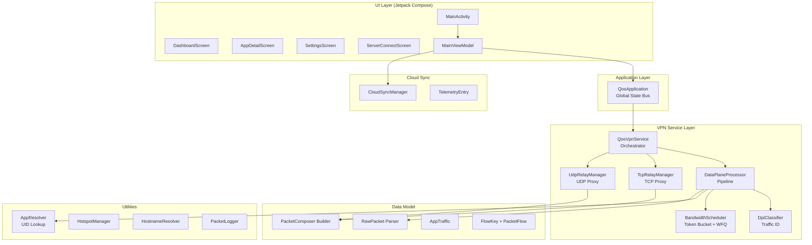

# QoS Scheduler — Giải Thích Toàn Diện (Chân Tơ Kẽ Tóc)

> Tài liệu này được viết để bạn có thể tự tin trình bày trước hội đồng chấm thi hoặc bất kỳ ai trong ngành CNTT. Mỗi phần đều có **phần giải thích đơn giản** (để trả lời câu hỏi phản biện) và **phần kỹ thuật chi tiết** (để chứng minh bạn hiểu sâu).

---

## Mục lục

1. [Tổng quan: App này làm gì?](#1-tổng-quan-app-này-làm-gì)
2. [Tech Stack (Công nghệ sử dụng)](#2-tech-stack)
3. [Kiến trúc tổng thể (Architecture)](#3-kiến-trúc-tổng-thể)
4. [Luồng dữ liệu End-to-End (Data Flow)](#4-luồng-dữ-liệu-end-to-end)
5. [Cơ chế 1: Đường hầm VPN (Traffic Interception)](#5-cơ-chế-1-đường-hầm-vpn)
6. [Cơ chế 2: Phân tích gói tin (Packet Parsing)](#6-cơ-chế-2-phân-tích-gói-tin)
7. [Cơ chế 3: Nhận diện lưu lượng (DPI Classification)](#7-cơ-chế-3-nhận-diện-lưu-lượng-dpi)
8. [Cơ chế 4: Xác định App sở hữu gói tin (UID Resolution)](#8-cơ-chế-4-xác-định-app-sở-hữu-gói-tin)
9. [Cơ chế 5: Lập lịch băng thông (Token Bucket + WFQ)](#9-cơ-chế-5-lập-lịch-băng-thông)
10. [Cơ chế 6: Chuyển tiếp gói tin (TCP/UDP Relay)](#10-cơ-chế-6-chuyển-tiếp-gói-tin-relay)
11. [Cơ chế 7: Tự bảo vệ (Health Monitor & Fallback)](#11-cơ-chế-7-tự-bảo-vệ)
12. [Cơ chế 8: Đồng bộ Cloud (Cloud Sync & Telemetry)](#12-cơ-chế-8-đồng-bộ-cloud)
13. [Cơ chế 9: Quản lý trạng thái UI (Reactive State)](#13-cơ-chế-9-quản-lý-trạng-thái-ui)
14. [Use Cases thực tế](#14-use-cases-thực-tế)
15. [UX/UI: Các màn hình và trải nghiệm người dùng](#15-uxui)
16. [Bản đồ Source Code (File Map)](#16-bản-đồ-source-code)
17. [Các câu hỏi phản biện thường gặp (FAQ)](#17-faq-phản-biện)

---

## 1. Tổng quan: App này làm gì?

### Giải thích đơn giản (30 giây)
> QoS Scheduler là một ứng dụng Android cho phép **kiểm soát tốc độ mạng của từng ứng dụng** trên điện thoại theo thời gian thực. Ví dụ: bạn đang chơi game mà Youtube chạy ngầm tải video → app này sẽ tự động "bóp" Youtube lại để nhường băng thông cho Game, giữ cho Game mượt mà không bị lag.

### Giải thích kỹ thuật (2 phút)
Ứng dụng sử dụng Android **VpnService API** để tạo một giao diện mạng ảo (TUN interface), qua đó **chặn toàn bộ gói tin IP** (IPv4 và IPv6) của mọi ứng dụng trên điện thoại. Mỗi gói tin được:

1. **Phân tích** (Parse) — đọc IP header, TCP/UDP header để biết gói tin đi đâu, từ đâu đến
2. **Xác định chủ sở hữu** (UID Resolution) — gọi API hệ thống để biết gói tin thuộc app nào (Chrome, Youtube, Game...)
3. **Phân loại** (DPI Classification) — dựa trên port đích để xác định loại lưu lượng (VoIP, Gaming, Web, Download...)
4. **Lập lịch** (Token Bucket + WFQ) — quyết định cho phép hoặc loại bỏ gói tin dựa trên mức ưu tiên của app
5. **Chuyển tiếp** (Relay) — mở kết nối thật đến server đích và trung chuyển dữ liệu

Toàn bộ quá trình trên diễn ra **trong user-space** (không cần root), xử lý hàng ngàn gói tin mỗi giây bằng Kotlin Coroutines.

---

## 2. Tech Stack

### Ngôn ngữ & Framework

| Công nghệ | Vai trò | Lý do chọn |
|---|---|---|
| **Kotlin** | Ngôn ngữ chính | Ngôn ngữ chính thức của Android, an toàn (null-safety), hỗ trợ Coroutines |
| **Jetpack Compose** | Giao diện UI | UI khai báo (Declarative), tự động cập nhật khi dữ liệu thay đổi |
| **Kotlin Coroutines** | Xử lý bất đồng bộ | Xử lý hàng ngàn gói tin/giây mà không block main thread |
| **Material Design 3** | Hệ thống thiết kế | Hỗ trợ Dynamic Color (Android 12+), Dark/Light theme tự động |

### Thư viện bên ngoài

| Thư viện | Vai trò |
|---|---|
| **OkHttp** | HTTP client cho Cloud Sync (gửi/nhận dữ liệu với Server) |
| **ZXing Android Embedded** | Quét mã QR để kết nối nhanh với Web Admin server |
| **AndroidX DataStore** | Lưu trữ cài đặt ưu tiên (thay thế SharedPreferences cũ) |

### API hệ thống Android

| API | Vai trò |
|---|---|
| **VpnService** | Tạo đường hầm VPN, chặn gói tin |
| **ConnectivityManager.getConnectionOwnerUid()** | Xác định app nào sở hữu một kết nối mạng (API 29+) |
| **PackageManager** | Tra cứu tên app từ UID |
| **NetworkInterface** | Phát hiện trạng thái Hotspot |

### Cấu hình Build

| Thông số | Giá trị |
|---|---|
| `minSdk` | **26** (Android 8.0 Oreo) |
| `targetSdk` | 35 |
| `compileSdk` | 35 |
| `jvmTarget` | 11 |

---

## 3. Kiến trúc tổng thể



### Mô hình kiến trúc: **Application-Singleton + VPN Service + Compose UI**

- **QosApplication** đóng vai trò "trạm trung chuyển dữ liệu" (State Bus) giữa VPN Service và UI, sử dụng `StateFlow`
- **QosVpnService** là trung tâm điều phối, quản lý toàn bộ vòng đời của VPN tunnel
- **MainViewModel** kết nối UI với dữ liệu, xử lý logic nghiệp vụ (chuyển priority, sync cloud)
- **Compose UI** chỉ quan sát (observe) trạng thái và hiển thị, không chứa logic xử lý nặng

---

## 4. Luồng dữ liệu End-to-End

### Luồng Outbound (App gửi dữ liệu ra Internet)

```
App (Chrome, Game...) gửi gói tin
        ↓
TUN Interface (Giao diện mạng ảo) bắt gói tin
        ↓
runTunReadLoop() — đọc raw bytes từ TUN
        ↓
packetChannel (hàng đợi 4096 gói)
        ↓
runPacketProcessLoop() — xử lý từng gói tin:
    │
    ├─ RawPacket.parse() → phân tích header IPv4/IPv6
    │
    ├─ DataPlaneProcessor.process():
    │     ├─ Bước 1: UID Resolution (app nào sở hữu?)
    │     ├─ Bước 2: DPI Classification (loại gì?)
    │     └─ Bước 3: Token Bucket (cho qua hay drop?)
    │
    ├─ Nếu MONITOR mode → ghi nhận thống kê, forward lại TUN
    │
    └─ Nếu RELAY mode:
          ├─ TCP? → TcpRelayManager.handlePacket()
          │         → Mở socket thật → gửi đến server đích
          └─ UDP? → UdpRelayManager.handlePacket()
                    → Mở DatagramSocket → gửi đến server đích
```

### Luồng Inbound (Internet trả dữ liệu về App)

```
Server đích trả dữ liệu về
        ↓
TcpRelayManager / UdpRelayManager nhận qua socket thật
        ↓
PacketComposer tạo gói tin IP giả (giả làm server gốc)
        ↓
emitPacketToTun():
    ├─ DataPlaneProcessor.process() (đếm bytes inbound)
    ├─ Token Bucket kiểm tra → nếu vượt giới hạn: DROP
    └─ Nếu cho qua → tunWriteChannel → ghi vào TUN
        ↓
TUN Interface trả gói tin cho App
        ↓
App nhận dữ liệu bình thường (không biết có VPN ở giữa)
```

> **Điểm mấu chốt:** Khi gói tin inbound bị DROP bởi Token Bucket, TCP Congestion Control sẽ tự động giảm tốc độ gửi từ phía server. Đây chính là cách app "bóp" băng thông download mà không cần can thiệp sâu vào giao thức TCP.

---

## 5. Cơ chế 1: Đường hầm VPN (Traffic Interception)

### Giải thích đơn giản
> Tưởng tượng mọi gói tin mạng trên điện thoại phải đi qua một "trạm kiểm soát" do app tạo ra. Trạm này đọc "nhãn" trên mỗi gói tin, quyết định cho đi nhanh hay đi chậm, rồi mới cho gói tin đi tiếp ra Internet.

### Chi tiết kỹ thuật

**File:** [QosVpnService.kt](file:///C:/Users/hieum/AndroidStudioProjects/QoSScheduler/app/src/main/java/com/qos/scheduler/service/QosVpnService.kt)

App sử dụng `android.net.VpnService` để tạo một **TUN interface** — một giao diện mạng ảo hoạt động ở Layer 3 (Network Layer) trong mô hình OSI.

```kotlin
// Tạo tunnel VPN
val builder = Builder()
    .setSession("QoS Scheduler")
    .addAddress("10.0.0.1", 32)              // IP ảo cho tunnel (IPv4)
    .addAddress("fd00:716f:733a:7363::1", 64) // IP ảo cho tunnel (IPv6)
    .setMtu(1400)                             // Maximum Transmission Unit
    .addRoute("0.0.0.0", 0)                  // Bắt TẤT CẢ traffic IPv4
    .addRoute("::", 0)                        // Bắt TẤT CẢ traffic IPv6
```

**Hai chế độ hoạt động:**

| Chế độ | Cách hoạt động | Code |
|---|---|---|
| **MONITOR** | Chỉ bắt gói tin của chính app QoS Scheduler → an toàn, không ảnh hưởng các app khác | `builder.addAllowedApplication(packageName)` |
| **RELAY** | Bắt gói tin của TẤT CẢ app trên điện thoại (trừ chính nó) → thực sự kiểm soát băng thông | `installedApps.forEach { builder.addAllowedApplication(it) }` |

**Vì sao loại trừ chính app QoS Scheduler khỏi VPN ở chế độ RELAY?**
> Nếu gói tin của app QoS Scheduler cũng đi qua VPN của chính nó → tạo ra vòng lặp vô hạn (infinite routing loop). Gói tin sẽ bị bắt → xử lý → gửi đi → lại bị bắt → lặp lại mãi mãi.

**DNS tự động:**
App tự phát hiện DNS server của hệ thống thông qua `ConnectivityManager.getLinkProperties()`, thay vì hardcode `8.8.8.8`. Nếu không tìm được → fallback về Google DNS.

---

## 6. Cơ chế 2: Phân tích gói tin (Packet Parsing)

### Giải thích đơn giản
> Mỗi gói tin mạng giống như một bức thư: có phần "bì thư" (header — ghi địa chỉ người gửi, người nhận) và phần "nội dung" (payload — dữ liệu thật, đã được mã hóa). App chỉ đọc phần "bì thư" để biết thư đi đâu, từ đâu, chứ KHÔNG đọc nội dung bên trong → bảo vệ quyền riêng tư.

### Chi tiết kỹ thuật

**File:** [RawPacket.kt](file:///C:/Users/hieum/AndroidStudioProjects/QoSScheduler/app/src/main/java/com/qos/scheduler/model/RawPacket.kt) (275 dòng)

Gói tin là một mảng byte thô (`ByteArray`). App phải tự phân tích từng byte theo chuẩn RFC:

#### IPv4 Parsing (RFC 791)

```
Byte 0:  [Version(4 bit)][IHL(4 bit)]  → Version=4, IHL×4 = header length
Byte 9:  Protocol                       → 6=TCP, 17=UDP
Byte 12-15: Source IP                   → 4 bytes → "192.168.1.1"
Byte 16-19: Destination IP              → 4 bytes → "8.8.8.8"
Byte IHL+0..1: Source Port              → 2 bytes
Byte IHL+2..3: Destination Port         → 2 bytes
```

#### IPv6 Parsing (RFC 8200)

IPv6 phức tạp hơn vì có **Extension Headers** (header mở rộng) tùy chọn:

```
Byte 0:   Version = 6
Byte 6:   Next Header (chỉ ra loại header tiếp theo)
Byte 8-23:  Source IPv6 (16 bytes = 128 bits)
Byte 24-39: Destination IPv6 (16 bytes = 128 bits)
Byte 40+:   Extension headers (nếu có) → phải duyệt chuỗi linked-list
```

App duyệt chuỗi Extension Header bằng vòng lặp `while`:

```kotlin
while (isExtensionHeader(nextHeader)) {
    // Hop-by-Hop (0), Routing (43), Fragment (44), Dest Options (60)
    val extLength = getExtensionLength(nextHeader, buffer, headerOffset)
    nextHeader = buffer.get(headerOffset) // Header tiếp theo
    headerOffset += extLength             // Nhảy qua header này
}
// Đến đây mới đến TCP/UDP header
```

#### TCP Metadata (RFC 793)

Nếu gói tin là TCP, app còn trích xuất thêm:
- **Sequence Number** (4 bytes) — số thứ tự của dữ liệu
- **ACK Number** (4 bytes) — xác nhận đã nhận đến đâu
- **Window Size** (2 bytes) — kích thước cửa sổ trượt (flow control)
- **Flags** (1 byte) — SYN, ACK, FIN, RST, PSH (các cờ điều khiển kết nối)

```kotlin
data class TcpControlFlags(
    val fin: Boolean,  // Kết thúc kết nối
    val syn: Boolean,  // Bắt đầu kết nối
    val rst: Boolean,  // Reset (buộc ngắt)
    val psh: Boolean,  // Push (gửi ngay, không buffer)
    val ack: Boolean   // Xác nhận
)
```

#### Tái tạo gói tin (PacketComposer)

**File:** [PacketComposer.kt](file:///C:/Users/hieum/AndroidStudioProjects/QoSScheduler/app/src/main/java/com/qos/scheduler/model/PacketComposer.kt) (348 dòng)

Là quá trình ngược lại — lắp ráp các trường dữ liệu thành mảng byte để ghi lại vào TUN:

```kotlin
// Tạo gói tin TCP IPv4 từ đầu
fun composeTcpV4(srcIp, srcPort, dstIp, dstPort, seqNum, ackNum, flags, window, payload): ByteArray {
    // Byte 0: 0x45 (Version=4, IHL=5 → 20 bytes header)
    // Byte 8: TTL=64
    // Byte 9: Protocol=6 (TCP)
    // Byte 10-11: IP Checksum (tính toán one's complement)
    // Byte 20+: TCP header (20 bytes) + payload
    // TCP Checksum bao gồm pseudo-header (srcIP, dstIP, protocol, length)
}
```

> **Câu hỏi phản biện thường gặp:** "Checksum tính như thế nào?"
> → One's complement sum: cộng tất cả các word 16-bit lại, fold carry, rồi đảo bit. Nếu kết quả = 0 thì thay bằng 0xFFFF (theo RFC của UDP).

---

## 7. Cơ chế 3: Nhận diện lưu lượng (DPI Classification)

### Giải thích đơn giản
> App nhìn vào "số phòng" (port number) mà gói tin gõ cửa để đoán loại dịch vụ. Giống như nhìn số phòng ở bệnh viện: phòng 443 = khoa Ngoại (HTTPS/Web), phòng 5060 = khoa Cấp cứu (VoIP), phòng 27015 = phòng Giải trí (Gaming).

### Chi tiết kỹ thuật

**File:** [DpiClassifier.kt](file:///C:/Users/hieum/AndroidStudioProjects/QoSScheduler/app/src/main/java/com/qos/scheduler/classifier/DpiClassifier.kt) (50 dòng)

"DPI" ở đây là **DPI Lite** — chỉ dùng port-based classification (không phân tích payload vì payload đã bị mã hóa TLS/HTTPS):

```kotlin
fun classify(packet: RawPacket): TrafficCategory {
    val port = packet.dstPort
    val protocol = packet.protocol

    return when {
        // UDP + port 5060-5061 hoặc 10000-20000 → VoIP (Zoom, Teams)
        protocol == UDP && (port in 5060..5061 || port in 10000..20000)
            → VOIP

        // Port 27015-27016 (Steam), 5000/5500 (Mobile Legends), 8001/8002
            → ONLINE_GAMING

        // Port 53 → DNS → phân loại là WEB_BROWSING (hạ tầng thiết yếu)
        // Port 1935, 8080 → STREAMING (RTMP, proxy)
        // Port 80, 443 → WEB_BROWSING (HTTP/HTTPS)
        // Port 21, 22, 143, 993, 110, 995 → FILE_TRANSFER (FTP, SSH, Email)
        else → UNKNOWN
    }
}
```

**Mỗi loại lưu lượng ánh xạ sang mức ưu tiên mặc định:**

| Loại lưu lượng | Mức ưu tiên | Port |
|---|---|---|
| VoIP | **HIGH** | UDP 5060-5061, 10000-20000 |
| Online Gaming | **HIGH** | 27015-27016, 5000, 5500, 8001-8002 |
| Web Browsing | **MEDIUM** | 80, 443, 53 |
| Streaming | **MEDIUM** | 1935, 8080 |
| File Transfer | **LOW** | 21, 22, 143, 993, 110, 995 |
| Unknown | **MEDIUM** | Tất cả port còn lại |

> **Hạn chế (nên thừa nhận khi bảo vệ):** Vì hầu hết ứng dụng hiện đại đều dùng HTTPS (port 443), nên Youtube, Tiktok, Chrome đều bị phân loại giống nhau là WEB_BROWSING. Muốn phân biệt chính xác hơn, cần kết hợp SNI (Server Name Indication) parsing hoặc Machine Learning — đây là hướng phát triển tương lai.

---

## 8. Cơ chế 4: Xác định App sở hữu gói tin (UID Resolution)

### Giải thích đơn giản
> Khi chặn được một gói tin, app cần biết "gói tin này thuộc về ứng dụng nào?" (Chrome? Youtube? Game?). Android cung cấp một API cho phép tra cứu điều này dựa trên địa chỉ IP và port.

### Chi tiết kỹ thuật

**Files:** [AppResolver.kt](file:///C:/Users/hieum/AndroidStudioProjects/QoSScheduler/app/src/main/java/com/qos/scheduler/util/AppResolver.kt) + [DataPlaneProcessor.kt](file:///C:/Users/hieum/AndroidStudioProjects/QoSScheduler/app/src/main/java/com/qos/scheduler/service/dataplane/DataPlaneProcessor.kt)

#### Bước 1: Gọi API hệ thống

```kotlin
// ConnectivityManager.getConnectionOwnerUid() — API 29+ (Android 10)
// Truyền vào: protocol, local address, remote address
// Trả về: UID (số nguyên định danh duy nhất cho mỗi app trên Android)
val uid = connectivityManager.getConnectionOwnerUid(
    protocol,       // 6=TCP, 17=UDP
    localAddress,   // InetSocketAddress(srcIp, srcPort)
    remoteAddress   // InetSocketAddress(dstIp, dstPort)
)
```

#### Bước 2: Tra tên app từ UID

```kotlin
// PackageManager.getPackagesForUid(uid) → ["com.android.chrome"]
// PackageManager.getApplicationLabel() → "Chrome"
```

Có bảng tra cứu cứng cho các UID hệ thống đặc biệt:
- UID 0 = Root
- UID 1000 = Android System
- UID 1001 = Phone/Telephony
- UID 2000 = Shell (ADB)

#### Bước 3: Caching & Synthetic UID

- **Flow Cache:** Một `ConcurrentHashMap<FlowKey, Int>` lưu kết quả tra cứu. Lần đầu mất ~1ms (syscall), lần sau tra cache = gần 0ms.
- **Synthetic UID:** Nếu không tra được app (VD: gói ICMP, gói từ kernel), app tạm gán UID âm = `-(port + 1)` và đặt tên tạm: port 53 → "DNS Traffic", port 443 → "HTTPS Traffic".
- **Retroactive Migration:** Khi sau đó tra được UID thật, dữ liệu thống kê (bytes, flows) được **chuyển ngược** (migrate) từ entry tạm sang entry app thật.

---

## 9. Cơ chế 5: Lập lịch băng thông (Token Bucket + WFQ)

### Giải thích đơn giản
> Tưởng tượng mỗi app có một "xô token" riêng. Mỗi giây, hệ thống đổ thêm token vào xô (tốc độ đổ tùy mức ưu tiên). Mỗi lần app muốn gửi 1 gói tin, phải lấy token từ xô ra. Nếu xô hết token → gói tin bị loại bỏ (drop), app bị "bóp" tốc độ.
>
> App ưu tiên HIGH được đổ nhiều token hơn → gửi được nhiều dữ liệu hơn.
> App ưu tiên LOW được đổ ít token → phải chờ lâu hơn giữa các gói tin.

### Chi tiết kỹ thuật

**File:** [BandwidthScheduler.kt](file:///C:/Users/hieum/AndroidStudioProjects/QoSScheduler/app/src/main/java/com/qos/scheduler/scheduler/BandwidthScheduler.kt) (172 dòng)

#### Token Bucket Algorithm

Mỗi app có một `TokenBucket(rateBps, burstBytes)`:

```
rateBps   = tốc độ nạp token (bytes/giây)
burstBytes = dung lượng tối đa của xô (cho phép burst ngắn hạn)
tokens    = số token hiện có (bắt đầu = burstBytes)
```

```kotlin
fun consume(packetSize: Int): Boolean {
    // 1. Nạp thêm token dựa trên thời gian đã trôi qua
    val elapsed = (now - lastRefill) / 1_000_000_000.0  // nano → giây
    tokens = min(burstBytes, tokens + rateBps * elapsed)
    lastRefill = now

    // 2. Thử tiêu thụ token
    if (tokens >= packetSize) {
        tokens -= packetSize
        return true   // GÓI TIN ĐƯỢC ĐI QUA ✅
    }
    return false      // GÓI TIN BỊ DROP ❌
}
```

#### Weighted Fair Queuing (WFQ)

Mỗi mức ưu tiên có một **trọng số** (weight):

| Mức ưu tiên | Trọng số |
|---|---|
| HIGH | 4 |
| MEDIUM | 2 |
| LOW | 1 |

Công thức phân bổ băng thông cho mỗi app:

```
rateBps_app = (uplinkBps × weight_app) / totalWeight
```

**Ví dụ cụ thể:**

Giả sử tổng băng thông = 10 Mbps, có 3 app:
- Chrome (HIGH, weight=4)
- Youtube (MEDIUM, weight=2)
- App tải file (LOW, weight=1)
- Host bucket (MEDIUM, weight=2) — luôn tồn tại

Tổng weight = 4 + 2 + 1 + 2 = 9

```
Chrome:  (10 × 4) / 9 = 4.44 Mbps
Youtube: (10 × 2) / 9 = 2.22 Mbps
Tải file: (10 × 1) / 9 = 1.11 Mbps
Host:     (10 × 2) / 9 = 2.22 Mbps
```

**Dynamic Rebalancing:** Mỗi khi app mới xuất hiện hoặc mức ưu tiên thay đổi, `rebalanceWithApps()` được gọi lại để tính toán lại tỉ lệ cho TẤT CẢ app.

**Manual Cap:** Admin có thể đặt giới hạn cứng cho từng app (VD: Youtube tối đa 1 Mbps) thông qua `setManualCap()`. App có manual cap sẽ không bị ảnh hưởng bởi WFQ.

---

## 10. Cơ chế 6: Chuyển tiếp gói tin (TCP/UDP Relay)

### Giải thích đơn giản
> Khi app thực sự muốn kiểm soát băng thông (chế độ RELAY, không chỉ giám sát), nó phải "đứng giữa" làm trung gian: nhận gói tin từ app, mở kết nối thật đến server, chuyển dữ liệu qua lại. Giống như một phiên dịch viên ngồi giữa hai người nói chuyện.

### TCP Relay — Chi tiết

**File:** [TcpRelayManager.kt](file:///C:/Users/hieum/AndroidStudioProjects/QoSScheduler/app/src/main/java/com/qos/scheduler/service/relay/TcpRelayManager.kt) (352 dòng)

TCP Relay phải mô phỏng một **TCP State Machine** hoàn chỉnh trong user-space:

#### Quy trình bắt tay 3 bước (Three-Way Handshake):

```
App (Chrome)          QoS Scheduler (Proxy)         Server (google.com)
     │                       │                           │
     │── SYN ──────────────→ │                           │
     │                       │  [Tạo TcpFlow, ghi nhận]  │
     │← SYN+ACK ────────────│  [Giả làm server]         │
     │                       │── connect() ─────────────→│  [Mở socket thật]
     │── ACK ──────────────→ │                           │
     │                       │  [State = ESTABLISHED]    │
     │                       │                           │
     │── Data ─────────────→ │── writeChannel ─────────→ │  [Forward data]
     │                       │                           │
     │← Data ────────────────│← readLoop ───────────────│  [Nhận response]
     │                       │  [PacketComposer tạo     │
     │                       │   gói tin giả]            │
```

**Các vấn đề kỹ thuật phải xử lý:**
1. **Sequence Number tracking:** Phải theo dõi chính xác `clientSeq` và `serverSeq` để TCP không bị lỗi
2. **Out-of-order packets:** Gói tin đến không đúng thứ tự → gửi lại ACK cho sequence đã nhận, drop gói tin lỗi
3. **Flow control:** Nếu `unackedBytes > clientWindow` → tạm dừng 50ms
4. **MTU chunking:** Dữ liệu từ server > 1340 bytes → chia thành nhiều TCP segment nhỏ
5. **Socket protection:** Gọi `VpnService.protect(socket)` để socket thật không bị VPN bắt lại (tránh routing loop)
6. **Giới hạn tài nguyên:** Tối đa 1000 kết nối TCP đồng thời

### UDP Relay — Chi tiết

**File:** [UdpRelayManager.kt](file:///C:/Users/hieum/AndroidStudioProjects/QoSScheduler/app/src/main/java/com/qos/scheduler/service/relay/UdpRelayManager.kt) (191 dòng)

UDP đơn giản hơn TCP vì không có trạng thái kết nối:

```
App gửi DNS query (UDP port 53)
    → UdpRelayManager nhận
    → Tạo DatagramSocket, protect() nó
    → Gửi DatagramPacket đến DNS server thật
    → Nhận response
    → PacketComposer tạo gói tin UDP response
    → Ghi vào TUN → App nhận DNS answer
```

**Timeout:** Mỗi UDP "flow" timeout sau 30 giây không hoạt động.
**Giới hạn:** Tối đa 2000 UDP flow đồng thời.

---

## 11. Cơ chế 7: Tự bảo vệ (Health Monitor & Fallback)

### Giải thích đơn giản
> App có cơ chế "cầu dao tự động": nếu phát hiện mạng bị lỗi do chính nó gây ra (DNS không phân giải được, quá nhiều kết nối TCP lỗi), nó sẽ tự động TẮT chế độ kiểm soát và chuyển về chế độ giám sát an toàn. Đảm bảo app KHÔNG BAO GIỜ làm mất internet của người dùng.

### Chi tiết kỹ thuật

**File:** [RelayRuntime.kt](file:///C:/Users/hieum/AndroidStudioProjects/QoSScheduler/app/src/main/java/com/qos/scheduler/service/RelayRuntime.kt) + [QosVpnService.kt](file:///C:/Users/hieum/AndroidStudioProjects/QoSScheduler/app/src/main/java/com/qos/scheduler/service/QosVpnService.kt#L296-L356)

Cứ mỗi 10 giây, `performHealthCheck()` chạy:

```kotlin
fun performHealthCheck() {
    // Giảm dần tỉ lệ lỗi (decay) để phục hồi tự nhiên
    dnsErrorRate *= 0.98
    tcpErrorRate *= 0.98

    // Chỉ fallback khi đã xử lý đủ nhiều gói tin (>100)
    // để tránh false positive khi mới khởi động
    if (currentMode != MONITOR && packetsInModeCount > 100) {
        val reason = when {
            dnsErrorRate > 0.7  → DNS_ERROR_RATE    // DNS hỏng > 70%
            activeFlows > 2000  → QUEUE_PRESSURE    // Quá tải
            else → null
        }
        if (reason != null) fallbackToMonitor(reason)
    }
}
```

**8 lý do có thể gây fallback:**

| Lý do | Mô tả |
|---|---|
| `DNS_ERROR_RATE` | Tỉ lệ lỗi DNS vượt 70% |
| `TCP_ERROR_RATE` | Quá nhiều kết nối TCP thất bại |
| `QUEUE_PRESSURE` | Hàng đợi gói tin quá tải (>2000 flow) |
| `PROCESSING_STALL` | Pipeline xử lý bị treo |
| `TUN_INTERFACE_FAILED` | Không tạo được tunnel VPN |
| `SYSTEM_PROTECT_FAILED` | Hệ thống từ chối bảo vệ socket |
| `UNSUPPORTED_TRAFFIC` | Loại traffic không hỗ trợ relay |
| `DEFAULT_MONITOR_MODE` | Người dùng chủ động chọn Monitor |

---

## 12. Cơ chế 8: Đồng bộ Cloud (Cloud Sync & Telemetry)

### Giải thích đơn giản
> App có thể kết nối với một máy chủ trung tâm (Web Admin). Từ đó, quản trị viên (IT công ty, phụ huynh) có thể ra lệnh từ xa: "Bóp Youtube xuống 1 Mbps" hoặc "Ưu tiên Zoom lên HIGH", và lệnh sẽ được áp dụng tức thì trên điện thoại.

### Chi tiết kỹ thuật

**File:** [CloudSyncManager.kt](file:///C:/Users/hieum/AndroidStudioProjects/QoSScheduler/app/src/main/java/com/qos/scheduler/sync/CloudSyncManager.kt) (206 dòng)

#### API Endpoints:

| Endpoint | Method | Chức năng |
|---|---|---|
| `/api/info` | GET | Kiểm tra server có sống không (ping) |
| `/api/devices` | POST | Đăng ký thiết bị lên server |
| `/api/policies?device_id=X` | GET | Tải chính sách QoS từ server |
| `/api/telemetry` | POST | Gửi thống kê bandwidth lên server |

#### Luồng Sync:

```
1. Người dùng quét QR Code → nhận URL server
2. App ping server (/api/info)
3. App đăng ký thiết bị (/api/devices) — gửi ID, tên, model
4. App tải policies (/api/policies) — nhận danh sách luật
5. Áp dụng từng policy: set priority + manual cap cho từng app
6. Bắt đầu gửi telemetry mỗi 2 giây (chỉ khi QoS đang bật)
```

#### Telemetry Data gửi lên server:

```kotlin
data class TelemetryEntry(
    val packageName: String,     // com.android.chrome
    val appName: String,         // Chrome
    val priority: String,        // HIGH/MEDIUM/LOW
    val bytesIn: Long,           // Tổng bytes tải xuống
    val bytesOut: Long,          // Tổng bytes tải lên
    val requestedBps: Long,      // Bandwidth app yêu cầu
    val allowedBps: Long,        // Bandwidth thực tế được cấp
    val droppedPkts: Long,       // Số gói tin bị drop
    val tcpFlows: Int,           // Số kết nối TCP đang hoạt động
    val udpFlows: Int            // Số kết nối UDP đang hoạt động
)
```

---

## 13. Cơ chế 9: Quản lý trạng thái UI (Reactive State)

### Giải thích đơn giản
> Giao diện app tự động cập nhật mà không cần người dùng kéo refresh. Giống như bảng điểm bóng đá trực tiếp — tỉ số thay đổi thì bảng tự cập nhật.

### Chi tiết kỹ thuật

**Pattern:** StateFlow-based Reactive Architecture

```
VPN Service (Producer)
    │
    ├─ updateApps(list) ────→ QosApplication._appsFlow.value = list
    ├─ updateDevices(list) ──→ QosApplication._devicesFlow.value = list
    ├─ updateRelayHealth() ──→ QosApplication._relayHealth.value = snapshot
    └─ setServiceRunning() ──→ QosApplication._isServiceRunning.value = true/false
                                        │
                                        ↓
                              MainViewModel.uiState = combine(
                                  isServiceRunning,
                                  devicesFlow,
                                  appsFlow,
                                  uplinkMbps,
                                  hotspotState,
                                  relayHealth,
                                  ...
                              ) → UiState(...)
                                        │
                                        ↓
                              Compose UI: collectAsStateWithLifecycle()
                              → Tự động recompose khi UiState thay đổi
```

**11 nguồn dữ liệu** được `combine()` lại thành 1 `UiState` duy nhất → UI luôn nhất quán.

---

## 14. Use Cases thực tế

### Use Case 1: Chơi Game không lag
**Tình huống:** Đang chơi PUBG, Youtube chạy ngầm tải video.
**Hành động:** Bật QoS → vào AppDetail của PUBG → chọn HIGH. Youtube tự động bị giảm tốc.
**Cơ chế bên trong:** Token Bucket của PUBG được cấp weight=4, Youtube weight=2. PUBG được 2x băng thông so với Youtube.

### Use Case 2: Giám sát lưu lượng mạng
**Tình huống:** Nghi ngờ một app đang gửi dữ liệu lén.
**Hành động:** Bật Monitor mode → xem Dashboard → thấy app X tiêu thụ bất thường → bấm vào xem chi tiết IP đích.
**Cơ chế bên trong:** DPI + UID Resolution xác định chính xác app và các kết nối đang hoạt động.

### Use Case 3: Quản lý từ xa (Doanh nghiệp)
**Tình huống:** IT muốn bóp Tiktok trên tất cả điện thoại nhân viên.
**Hành động:** Tạo policy trên Web Admin → nhân viên quét QR → policy tự động áp dụng.
**Cơ chế bên trong:** CloudSync tải policy → `updateAppPriority(uid, LOW)` → `BandwidthScheduler.rebalanceWithApps()` → Tiktok bị cấp ít token hơn.

---

## 15. UX/UI

### Các màn hình

| Màn hình | File | Chức năng |
|---|---|---|
| **Dashboard** | [DashboardScreen.kt](file:///C:/Users/hieum/AndroidStudioProjects/QoSScheduler/app/src/main/java/com/qos/scheduler/ui/screens/DashboardScreen.kt) | Tổng quan: Switch bật/tắt, thống kê tổng, danh sách app |
| **App Detail** | [AppDetailScreen.kt](file:///C:/Users/hieum/AndroidStudioProjects/QoSScheduler/app/src/main/java/com/qos/scheduler/ui/screens/AppDetailScreen.kt) | Chi tiết app: throughput, chọn priority, xem kết nối |
| **Settings** | [SettingsScreen.kt](file:///C:/Users/hieum/AndroidStudioProjects/QoSScheduler/app/src/main/java/com/qos/scheduler/ui/screens/SettingsScreen.kt) | Cấu hình: chế độ, uplink, health metrics |
| **Server Connect** | [ServerConnectScreen.kt](file:///C:/Users/hieum/AndroidStudioProjects/QoSScheduler/app/src/main/java/com/qos/scheduler/ui/screens/ServerConnectScreen.kt) | Kết nối Cloud: QR scan, nhập URL, sync |

### Navigation

```
Dashboard ──→ AppDetail (bấm vào app)
    │              └─── Back ──→ Dashboard
    │
    └──→ Settings (bấm icon ⚙️)
             │
             └──→ ServerConnect (bấm "Kết nối Server")
                      └─── Back ──→ Settings
```

Sử dụng **state-based navigation** (không dùng Navigation Component):
```kotlin
var currentScreen by remember { mutableStateOf<Screen>(Screen.Dashboard) }
```

---

## 16. Bản đồ Source Code (File Map)

```
app/src/main/java/com/qos/scheduler/
├── MainActivity.kt              # Activity chính, navigation
├── QosApplication.kt            # Global state bus (StateFlow)
│
├── classifier/
│   └── DpiClassifier.kt         # Nhận diện loại traffic (port-based)
│
├── model/
│   ├── AppTraffic.kt             # Data class: thống kê per-app
│   ├── ConnectedDevice.kt        # Data class: thiết bị kết nối
│   ├── FlowKey.kt                # 5-tuple key (src/dst IP, port, protocol)
│   ├── PacketComposer.kt         # Tạo gói tin IP từ đầu (inverse of RawPacket)
│   ├── PacketFlow.kt             # Thống kê per-flow
│   ├── Protocol.kt               # Enum: TCP(6), UDP(17), OTHER
│   ├── RawPacket.kt              # Parser gói tin IPv4/IPv6 byte-by-byte
│   ├── TrafficCategory.kt        # Enum: VOIP, GAMING, WEB, STREAMING...
│   └── TrafficClass.kt           # Enum: HIGH, MEDIUM, LOW
│
├── registry/
│   └── DeviceRegistry.kt         # Quản lý thiết bị hotspot (legacy)
│
├── scheduler/
│   └── BandwidthScheduler.kt     # Token Bucket + WFQ algorithm
│
├── service/
│   ├── QosVpnService.kt          # VPN Service chính (orchestrator)
│   ├── RelayRuntime.kt           # Enum mode + HealthSnapshot model
│   ├── dataplane/
│   │   └── DataPlaneProcessor.kt # Pipeline: parse → classify → schedule
│   └── relay/
│       ├── TcpRelayManager.kt    # TCP proxy (full state machine)
│       └── UdpRelayManager.kt    # UDP relay (connectionless)
│
├── sync/
│   └── CloudSyncManager.kt      # OkHttp client: sync policies, telemetry
│
├── ui/
│   ├── MainViewModel.kt          # ViewModel: kết nối UI ↔ Service
│   ├── screens/
│   │   ├── DashboardScreen.kt    # Màn hình chính
│   │   ├── AppDetailScreen.kt    # Chi tiết app
│   │   ├── SettingsScreen.kt     # Cài đặt
│   │   └── ServerConnectScreen.kt# Kết nối server
│   └── theme/
│       ├── Color.kt              # Bảng màu Material3
│       ├── Theme.kt              # Dynamic Color + Dark/Light
│       └── Type.kt               # Typography
│
└── util/
    ├── AppResolver.kt            # UID → App name resolver
    ├── DiagnosticTool.kt         # Debug logging (excluded from worktree)
    ├── HostnameResolver.kt       # IP → hostname (reverse DNS)
    ├── HotspotManager.kt         # Phát hiện trạng thái Hotspot
    └── PacketLogger.kt           # IPv4/IPv6 packet stats logger
```

---

## 17. FAQ — Các câu hỏi phản biện thường gặp

### Q: "Tại sao không dùng Root để kiểm soát mạng trực tiếp ở kernel?"
> **A:** Root yêu cầu người dùng phải "jailbreak" điện thoại, vi phạm bảo mật và mất bảo hành. VpnService API cho phép làm việc tương tự ở user-space mà không cần root, tuy hiệu năng thấp hơn nhưng an toàn hơn và dễ triển khai trên mọi thiết bị.

### Q: "App có đọc nội dung dữ liệu (payload) của người dùng không?"
> **A:** Không. App chỉ đọc phần header (IP header + TCP/UDP header) để biết gói tin đi đâu, từ đâu, thuộc app nào. Payload (nội dung thật) đã được mã hóa TLS/HTTPS → app không thể đọc, và cũng không cần đọc.

### Q: "Nếu app crash hoặc lỗi thì mất internet luôn à?"
> **A:** Không. App có cơ chế "fail-open": (1) Health Monitor tự động fallback về Monitor mode khi phát hiện lỗi. (2) Khi service bị kill, Android tự động gỡ bỏ VPN tunnel → mạng trở lại bình thường. (3) Người dùng luôn có thể tắt VPN từ notification bar hoặc Settings.

### Q: "Vì sao chọn port-based classification thay vì Machine Learning?"
> **A:** Port-based classification xử lý nhanh (O(1) lookup), không cần training data, không tiêu thụ CPU/RAM nhiều. Phù hợp cho xử lý real-time hàng ngàn gói tin mỗi giây trên điện thoại. Machine Learning phù hợp hơn cho server-side analysis ở hướng phát triển tương lai.

### Q: "Token Bucket khác gì so với Leaky Bucket?"
> **A:** Token Bucket cho phép **burst** (gửi dữ liệu ồ ạt trong thời gian ngắn nếu có đủ token tích lũy), phù hợp với đặc tính lưu lượng mạng (không đều, có burst). Leaky Bucket ép tốc độ đều đặn → không tốt cho trải nghiệm duyệt web hay gaming (cần burst ngắn để tải trang nhanh).

### Q: "App có thể bóp băng thông thiết bị khác đang kết nối Hotspot không?"
> **A:** Không thể, do rào cản bảo mật của Android. Lưu lượng từ thiết bị kết nối Hotspot đi thẳng xuống kernel networking stack, bỏ qua VPN tunnel. Muốn kiểm soát lưu lượng Hotspot cần quyền Root hoặc custom ROM. App hiện tại chỉ kiểm soát lưu lượng của **các ứng dụng chạy trên chính chiếc điện thoại cài app**.

### Q: "Concurrency xử lý ra sao? Có bị race condition không?"
> **A:** Sử dụng `ConcurrentHashMap` cho tất cả shared state (flowCache, appTraffic, buckets). Dùng Kotlin Channel (capacity 4096) làm hàng đợi giữa read loop và process loop — thread-safe by design. Coroutine scope gắn với vòng đời Service → tự cancel khi service dừng, tránh memory leak.

### Q: "Tại sao chọn OkHttp thay vì Retrofit cho Cloud Sync?"
> **A:** Chỉ có 4 API endpoint đơn giản. OkHttp đủ dùng mà không cần thêm layer abstraction (Retrofit). Giảm kích thước APK và complexity. Nếu mở rộng thêm nhiều API → sẽ cân nhắc migrate sang Retrofit.

### Q: "Throughput hiển thị trên UI tính bằng gì? bits hay bytes?"
> **A:** Biến `currentThroughputBps` tính bằng **bits per second (bps)** — đúng chuẩn mạng. UI hiển thị đơn vị **Mbps** (Megabits per second), nhất quán giữa Dashboard và AppDetail.
