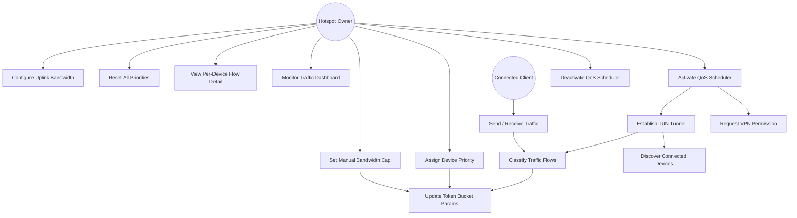
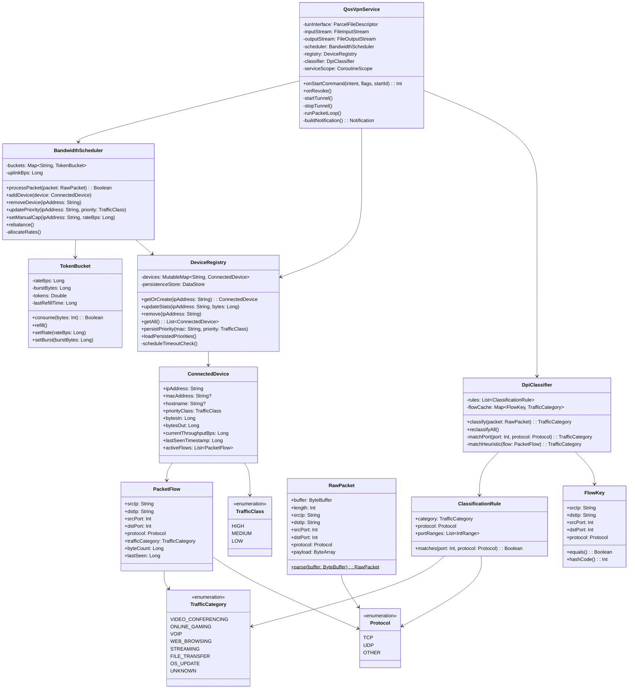
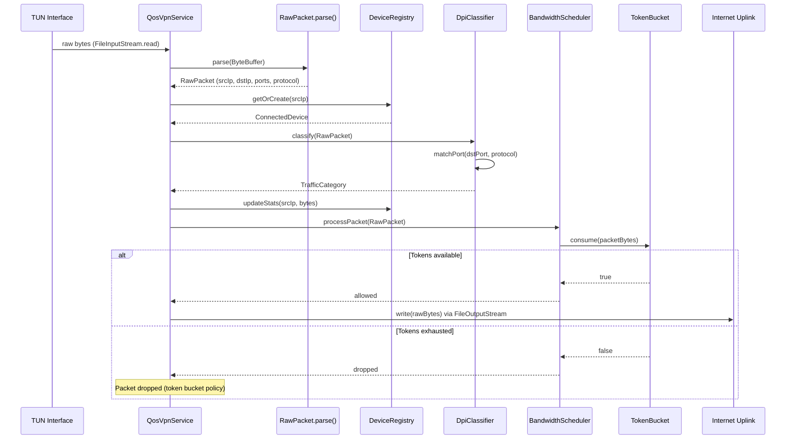
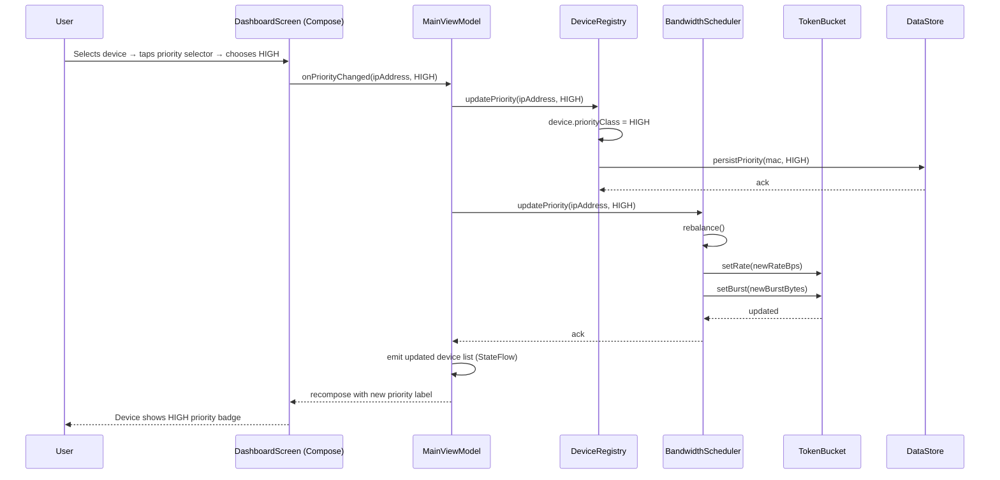
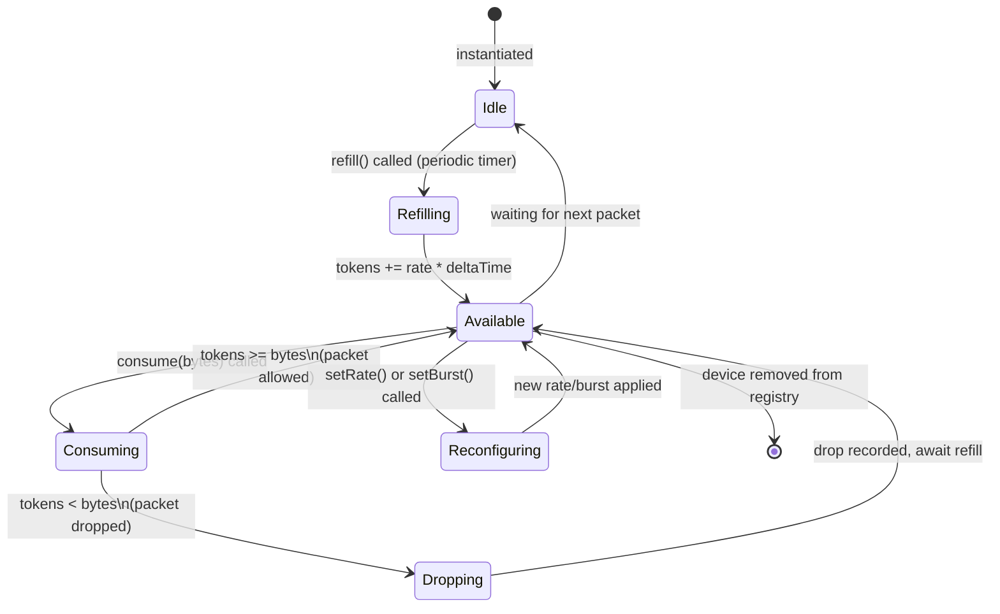
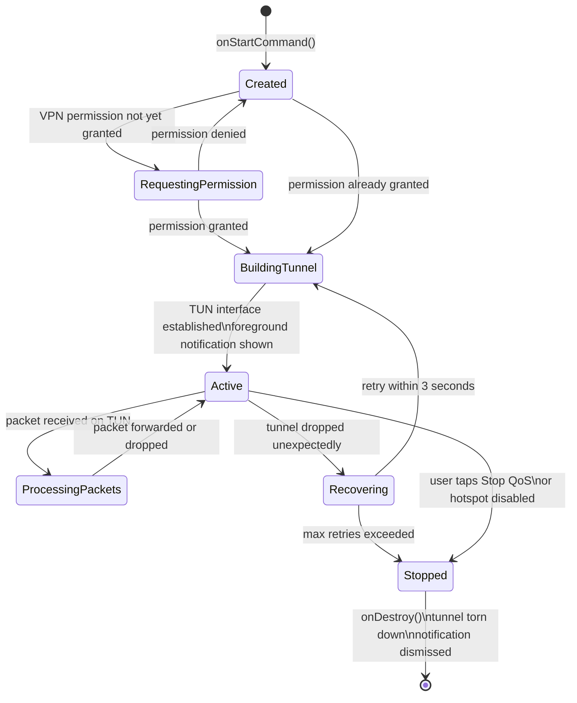
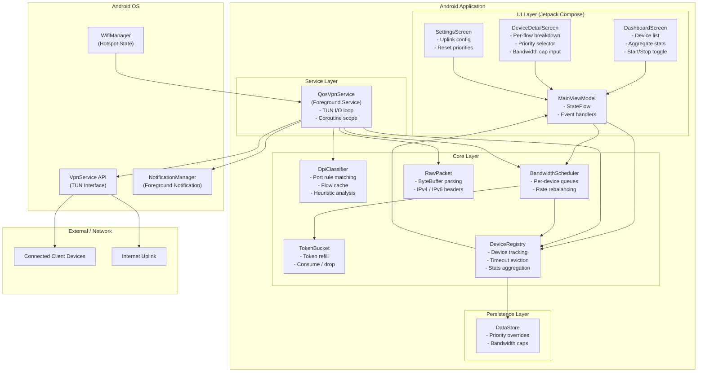

# UML Diagrams
## Dynamic QoS Scheduler for Mobile Hotspots

**Version:** 1.0  
**Author:** Phạm Hiếu Minh — 23BI14295  

---

## Table of Contents

1. [Use Case Diagram](#1-use-case-diagram)
2. [Class Diagram](#2-class-diagram)
3. [Sequence Diagram — Packet Processing Flow](#3-sequence-diagram--packet-processing-flow)
4. [Sequence Diagram — User Assigns Device Priority](#4-sequence-diagram--user-assigns-device-priority)
5. [State Diagram — Token Bucket](#5-state-diagram--token-bucket)
6. [State Diagram — QoS Service Lifecycle](#6-state-diagram--qos-service-lifecycle)
7. [Component Diagram](#7-component-diagram)

---

## 1. Use Case Diagram

---

## 2. Class Diagram

---

## 3. Sequence Diagram — Packet Processing Flow

Shows the lifecycle of a single packet from TUN ingress to uplink egress.

---

## 4. Sequence Diagram — User Assigns Device Priority

Shows the interaction chain when the user changes a device's priority class from the UI.

---

## 5. State Diagram — Token Bucket

Shows the internal states of a single token bucket instance during packet processing.

---

## 6. State Diagram — QoS Service Lifecycle

Shows the full lifecycle of the QosVpnService from creation to destruction.

---

## 7. Component Diagram

Shows the major architectural components, their responsibilities, and dependencies.

